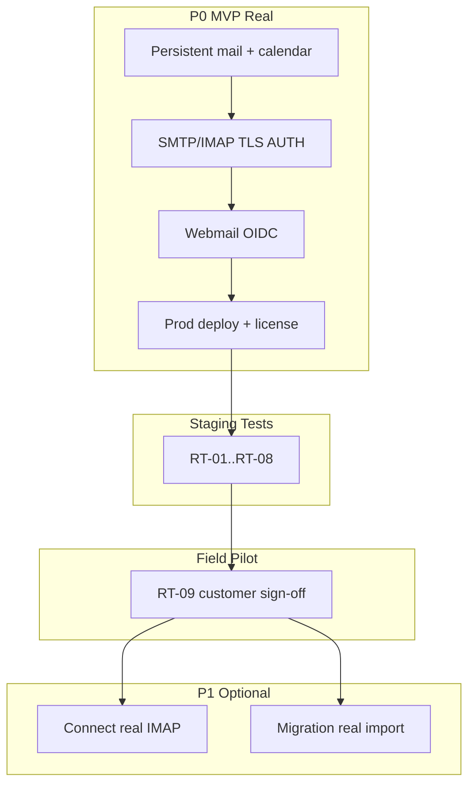

# ERA Communications — Gap-лист до реального пилота

**Версия:** 1.0  
**Дата:** 7 июля 2026 г.  
**Статус:** Active — исполняемый backlog до field pilot  
**Связано:** [`Comms-Pilot-Readiness-Checklist.md`](Comms-Pilot-Readiness-Checklist.md) · [`Comms-Stage-CGA-Spec.md`](Comms-Stage-CGA-Spec.md) · [`Comms-Implementation-Matrix.md`](Comms-Implementation-Matrix.md) · [`products/PRD-Comms-Gov-Protocols.md`](products/PRD-Comms-Gov-Protocols.md)

---

## 1. Резюме

**8 волн программы (C-1…C-5, C-MIG, C-GA)** закрыты на уровне **scaffold + auto-gate** (unit/smoke, in-memory stores, dev-bypass лицензий). Это **не** эквивалент реального пилота у заказчика.

**Правило до пилота:** полевые и «реальные» acceptance-тесты **не запускаются**, пока не закрыты пункты **P0** и **P0-GOV** этого документа. Текущие `run-comms-stage-gate.ps1` остаются **regression scaffold gates**, не pilot sign-off.

| Контур пилота | Издание | Целевой scope |
|---------------|---------|---------------|
| **Gov MVP pilot (обязательный)** | ERA Mail Server + Client | P0 + **P0-GOV** (Outlook/mobile protocols) |
| **Hybrid (опционально)** | ERA Mail Connect | C-1.1 |
| **Cutover (опционально)** | ERA Comms Migration | C-MIG |
| **Не в первый gov pilot** | Chat, Conference, Comms AI | C-4, C-5 |

---

## 2. Текущее состояние vs «реальный продукт»

| Область | Сейчас (код) | Нужно для пилота |
|---------|--------------|------------------|
| Mail storage | In-memory (`MailStore` Rust) | Persistent store (Postgres/MinIO/SQLite — ADR) |
| SMTP/IMAP | Minimal subset, no AUTH/TLS | AUTH, STARTTLS/TLS, лимиты размера, multi-recipient |
| Policy (AC-C4) | GET API only | Enforcement при send/store/attach |
| Webmail (AC-C2) | JSON shell `ui/mail/` | SPA + OIDC + inbox/compose → mail-api |
| Identity | Header RBAC (`X-ERA-Tenant`) | `platform/identity` OIDC end-to-end |
| CalDAV/EWS (AC-C8/C9) | In-memory calendar/EWS scaffold | **P0-GOV:** persistent + Outlook field parity |
| CardDAV contacts | Нет | **P0-GOV:** CardDAV + EWS Contacts |
| ActiveSync mobile | Blocked CM5-9 | **P0-GOV:** ActiveSync subset (gov must-have) |
| EWS Notes/Tasks | Нет | **P0-GOV:** EWS subset (не MAPI) |
| Mail Connect (AC-C6) | Fake sync (`ItemsOK: 12`) | Real IMAP/JMAP client, creds vault |
| Migration (AC-MIG) | File-line importer | Network IMAP + write to mail store |
| Deploy | Dev compose + ручной запуск | `deploy/profiles/comms.yaml` → prod compose, один `up` |
| License | `ERA_MAIL_DEV=1` bypass | Offline Ed25519 token, sealed modules |
| Air-gap E2E (F-C6) | Waiver / чеклист `[x]` без поля | Compose без internet + подпись заказчика |
| C-GA sign-off | Шаблон с пустыми полями | PO + customer signature |

---

## 3. P0 — блокеры реального MVP-пилота (Mail Server)

Закрыть **все** перед выездом. Без этого пилот не начинается.

### P0-1. Персистентность почты и календаря

| ID | Задача | Модуль | Критерий готовности |
|----|--------|--------|---------------------|
| GAP-P0-01 | Persistent mail store (не in-memory) | `mail/core`, `mail/internal` | Рестарт процесса — письма на месте; backup/restore smoke |
| GAP-P0-02 | Mailbox provisioning API/CLI | `mail-api` | Создание ящика `alice@domain`, пароль, квота |
| GAP-P0-03 | Persistent CalDAV store | `calendar/store` | Событие переживает рестарт; Outlook CalDAV smoke |
| GAP-P0-04 | EWS mail store persistent | `mail/internal/ews/mstore` | Send/receive через EWS после рестарта |

### P0-2. Протоколы и безопасность

| ID | Задача | Модуль | Критерий готовности |
|----|--------|--------|---------------------|
| GAP-P0-10 | SMTP AUTH + STARTTLS | `mail/core/smtp.rs` | Thunderbird/Outlook SMTP submit с TLS |
| GAP-P0-11 | IMAP AUTH + TLS | `mail/core/imap.rs` | LOGIN с реальным паролем; не fake LOGIN |
| GAP-P0-12 | IMAP subset расширить | `mail/core/imap.rs` | UID FETCH, SEARCH, LIST folders, >1 message |
| GAP-P0-13 | HTTP/TLS mail-api | `mail/cmd/mail-api` | mTLS или TLS termination; не plain :8150 в prod |
| GAP-P0-14 | Policy enforcement | `policy` + core bridge | Превышение quota/size → отказ SMTP/API |

### P0-3. Webmail и identity (AC-C2)

| ID | Задача | Модуль | Критерий готовности |
|----|--------|--------|---------------------|
| GAP-P0-20 | OIDC login в webmail | `ui/mail` + `platform/identity` | Browser redirect → session → `/mail` |
| GAP-P0-21 | Inbox UI (list/read) | `ui/mail` | IMAP/API poll → отображение писем |
| GAP-P0-22 | Compose → send | `ui/mail` → `mail-api` → core | Alice send → Bob inbox в UI и IMAP |
| GAP-P0-23 | Policy UI | `ui/mail` | Quota/limit из `/api/v1/policy` |
| GAP-P0-24 | Drive hook (if licensed) | `ui/mail` + `platform/drive` | AC-C5 на стенде с Drive license |

Спека C-3 требует OIDC/SPA — сейчас реализован только RBAC-shell ([`ui/mail/server.go`](../ui/mail/server.go)).

## 3b. P0-GOV — протоколы Outlook / mobile (госсектор)

**PRD:** [`PRD-Comms-Gov-Protocols.md`](products/PRD-Comms-Gov-Protocols.md). Без закрытия **P0-GOV** госсектор не заходит в пилот.

| ID | Задача | Модуль | Критерий |
|----|--------|--------|----------|
| GAP-GOV-01 | Autodiscover EXCH + TLS/SCP | `mail/autodiscover` | Outlook → Exchange profile |
| GAP-GOV-02 | EWS façade v2 (mail+calendar) | `mail/ews` | FindFolder, SyncFolderItems, Create/Update/Delete |
| GAP-GOV-03 | CalDAV production + invitations | `calendar/caldav` | AC-C8 field + Apple/Thunderbird |
| GAP-GOV-04 | CardDAV contacts | `calendar/carddav` or `contacts/` | AC-GOV-3 field |
| GAP-GOV-05 | EWS Contacts subset | `mail/ews` | Outlook contacts sync |
| GAP-GOV-06 | EWS Notes/Tasks subset | `mail/ews` | Tender-dependent field matrix |
| GAP-GOV-07 | ActiveSync subset | `mail/activesync` | iOS/Android mail+calendar+contacts |
| GAP-GOV-08 | **Explicit:** no MAPI, no Outlook Connector | docs/RFQ | ADR + RFQ wording |

### P0-4. Deploy и операции

| ID | Задача | Модуль | Критерий готовности |
|----|--------|--------|---------------------|
| GAP-P0-30 | Prod compose profile `comms` | `deploy/` | `docker compose --profile comms up` — mail-core, mail-api, CH, PG |
| GAP-P0-31 | Init DDL all comms tables | `deploy/clickhouse/` | 004…006 применяются автоматически |
| GAP-P0-32 | Health/readiness probes | all comms services | K8s/compose health для пилота |
| GAP-P0-33 | Offline license activation | `licensegate` + install | Без `ERA_MAIL_DEV`; модуль `comms-mail-server` |
| GAP-P0-34 | Runbook пилота | `docs/` | Install, rollback, backup, типовые инциденты |
| GAP-P0-35 | Честный pilot checklist | `Comms-Pilot-Readiness-Checklist.md` | Сброс преждевременных `[x]`; заполнение на поле |

### P0-5. Документация и статус (честность)

| ID | Задача | Файл | Критерий |
|----|--------|------|----------|
| GAP-P0-40 | Перевести C-GA в `[~]` до поля | `Comms-Sprint-Index.md`, CGA spec | CM-GA-3, CM-GA-5 = field pending |
| GAP-P0-41 | Матрица: scaffold vs pilot-ready | `Comms-Implementation-Matrix.md` | Колонка «Pilot-ready» |
| GAP-P0-42 | MVP-spec: убрать soft-close | `Comms-MVP-Spec.md` | F-C6 не `[x]` до поля |

---

## 4. P1 — гибрид и миграция (если в scope пилота)

Не блокирует **greenfield** Mail Server pilot; обязательно, если заказчик на Connect/Migration.

### P1-1. ERA Mail Connect (C-1.1)

| ID | Задача | Сейчас | Критерий |
|----|--------|--------|----------|
| GAP-P1-01 | Real IMAP sync client | `StartSync` возвращает fake 12 items | Реальный FETCH с внешнего IMAP |
| GAP-P1-02 | Credential vault | `password_ref` не используется | TPM/keystore ref, не plaintext |
| GAP-P1-03 | Autodiscover Connect field | golden only | Outlook → external server через Connect |
| GAP-P1-04 | Edition `exists: true` | `editions-comms.yaml` false | licensegate + pricing |

### P1-2. ERA Comms Migration (C-MIG)

| ID | Задача | Сейчас | Критерий |
|----|--------|--------|----------|
| GAP-P1-10 | Network IMAP importer | `ImportMailbox` читает файл | RFC3501 client → mail store |
| GAP-P1-11 | Write path в mail-core | нет | Imported message в ящике через IMAP |
| GAP-P1-12 | EWS calendar → ERA store | stub | AC-MIG-2 field |
| GAP-P1-13 | PST/MBOX production path | smoke | AC-MIG-3 на реальном архиве |
| GAP-P1-14 | Idempotent delta | тест на mock | Re-run без дублей на field corpus |
| GAP-P1-15 | CH migration_job audit | partial | AC-MIG-4 rows в field |

---

## 5. P2 — Phase 2/3 (после MVP pilot)

Не входят в **первый** реальный пилот Mail Server. Отдельные edition GA.

| ID | Компонент | Сейчас | До «реального» edition |
|----|-----------|--------|----------------------|
| GAP-P2-01 | ERA Chat | In-memory rooms | Matrix-layout homeserver или эквивалент |
| GAP-P2-02 | ERA Conference | `adapter.Stub` | LiveKit on-prem deploy + real tokens |
| GAP-P2-03 | ERA Comms AI | `Heuristic` default | Bundled on-prem model + Ollama ops |
| GAP-P2-04 | ActiveSync | `[blocked]` CM5-9 | Отдельный PRD + реализация |
| GAP-P2-05 | 60k scale field | CI 1000 mailboxes | `loadgen-mailboxes -mailboxes 60000` на sizing-сервере |
| GAP-P2-06 | HA / multi-node | нет | Kafka RF, mail replication (Vision) |

---

## 6. Реальные тесты — только после P0

### 6.1. Что считается «реальным тестом»

| Тип | Когда | Пример |
|-----|-------|--------|
| **Scaffold gate** | Сейчас (регрессия) | `go test`, `cargo test`, golden |
| **Staging integration** | После P0-1…P0-4 | Compose prod profile, TLS, multi-service |
| **Field pilot test** | После P0 + staging PASS | Air-gap site, customer clients |
| **Soak / scale** | После pilot MVP | 7×24, 60k (отдельный sizing gate) |

### 6.2. Матрица реальных тестов (запускать после P0)

| ID | Тест | PRD/AC | Доказательство | Предусловие |
|----|------|--------|----------------|-------------|
| RT-01 | Air-gap compose E2E | F-C6, AC-C1 | `reports/comms-pilot-airgap-*.log` | P0-30, firewall |
| RT-02 | Outlook desktop (EWS) | AC-C9 | Pilot checklist §3 | P0-04, P0-12 |
| RT-03 | Thunderbird IMAP+CalDAV | AC-C1, AC-C8 | Pilot checklist §3 | P0-10…P0-12 |
| RT-04 | Mobile IMAP (no ActiveSync) | AC-C1 | Pilot checklist §3 | P0-11 |
| RT-05 | Webmail full flow | AC-C2 | Screenshot + API log | P0-20…P0-22 |
| RT-06 | ClickHouse audit trail | AC-C7 | CH query post-send | P0-01, P0-31 |
| RT-07 | Policy deny over quota | AC-C4 | SMTP 552 / API 413 | P0-14 |
| RT-08 | Offline license | ADR-0010 | No DEV bypass | P0-33 |
| RT-09 | Customer sign-off | CM-GA-5 | Signed checklist | RT-01…RT-08 PASS |
| RT-10 | Connect sync (optional) | AC-C6 | External IMAP delta | P1-01…P1-03 |
| RT-11 | Migration cutover (optional) | AC-MIG-* | Migration job log | P1-10…P1-14 |

### 6.3. Команды (после реализации P0)

```powershell
# Staging (в ЦОД/lab, не на ноуте)
./scripts/run-comms-pilot-staging.ps1    # TODO: создать после P0-30

# Field (только после staging PASS)
./scripts/run-comms-pilot-field.ps1      # TODO: создать; replaces waiver F-C6

# Regression scaffold (можно всегда)
./scripts/run-comms-stage-gate.ps1 -Stage C-1
./scripts/run-comms-acceptance.ps1
```

---

## 7. Предлагаемые исполняемые волны (post-scaffold)



| Волна | ID | Фокус | Gate |
|-------|-----|-------|------|
| **R-1** | GAP-P0-01…04 | Persistence | integration + restart test |
| **R-2** | GAP-P0-10…14 | Protocols + policy | cargo e2e + SMTP client |
| **R-3** | GAP-P0-20…24 | Webmail + identity | browser E2E (staging) |
| **R-4** | GAP-P0-30…35 | Deploy + ops | compose prod smoke |
| **R-5** | RT-01…RT-09 | **Real pilot tests** | field logs + sign-off |
| **R-6** | P1-* | Connect/Migration | optional upsell pilot |

---

## 8. Exit criteria — «можно ехать к заказчику»

Все пункты обязательны:

- [ ] P0-01…P0-04 — persistence PASS
- [ ] P0-10…P0-14 — SMTP/IMAP/TLS/policy PASS на staging
- [ ] P0-20…P0-22 — webmail send/receive PASS
- [ ] P0-30…P0-33 — prod compose + offline license PASS
- [ ] RT-01…RT-08 — staging integration PASS (логи в `reports/`)
- [ ] Runbook и rollback проверены на staging
- [ ] `Comms-Pilot-Readiness-Checklist` — честное заполнение, без DEV bypass
- [ ] PO approval на выезд

**Не требуется для gov pilot:** Chat, Conference, Comms AI, 60k field (если не в контракте).  
**Обязательно для gov pilot:** P0-GOV (EWS, CalDAV, CardDAV, ActiveSync subset).

---

## 9. Связанные документы

- [`Comms-Pilot-Readiness-Checklist.md`](Comms-Pilot-Readiness-Checklist.md) — перезаполнить после P0
- [`Comms-Stage-CGA-Spec.md`](Comms-Stage-CGA-Spec.md) — CM-GA-3/5 = field pending
- [`Field-Server-Sizing.md`](Field-Server-Sizing.md) — sizing для RT-01 staging
- [`PRD-Comms-MVP.md`](products/PRD-Comms-MVP.md) — scope MVP pilot
- [`editions-comms.yaml`](../editions-comms.yaml) — только `era-mail-server: ga` целевой для pilot

---

## 10. История статуса scaffold (для аудита)

| Дата | Событие |
|------|---------|
| 2026-07-07 | 8 волн scaffold закрыты auto-gate; C-GA sign-off шаблон без подписи |
| 2026-07-07 | Этот gap-лист: переход к **real pilot** backlog (R-1…R-5) |
