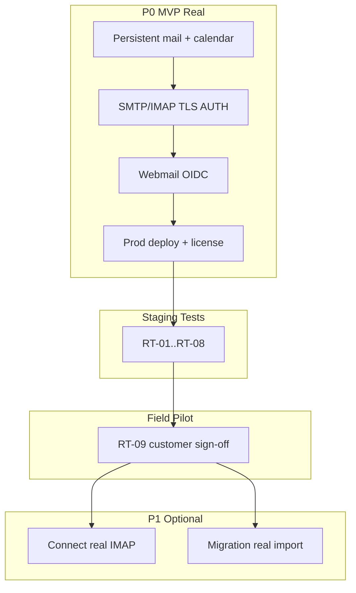

# ERA Communications — Gap-лист до реального пилота

**Версия:** 1.1  
**Дата:** 30 июля 2026 г.  
**Статус:** Active — исполняемый backlog до field pilot (+ Matrix AC honesty)  
**Связано:** [`Comms-Pilot-Readiness-Checklist.md`](Comms-Pilot-Readiness-Checklist.md) · [`Comms-Stage-CGA-Spec.md`](Comms-Stage-CGA-Spec.md) · [`Comms-Implementation-Matrix.md`](Comms-Implementation-Matrix.md) · [`products/PRD-Comms-Gov-Protocols.md`](products/PRD-Comms-Gov-Protocols.md) · приёмка [`Comms-Acceptance-System.md`](products/Comms-Acceptance-System.md) · канон [`ERA-Product-Acceptance-Standard.md`](products/ERA-Product-Acceptance-Standard.md)

---

## 1. Резюме

**8 волн программы (C-1…C-5, C-MIG, C-GA)** закрыты на уровне **scaffold + auto-gate** (unit/smoke, in-memory stores, dev-bypass лицензий). Это **не** эквивалент реального пилота у заказчика.  
**Honesty (канон v1.2):** AC rollup SSOT = [`Comms-Implementation-Matrix.md`](Comms-Implementation-Matrix.md) — edition/AC mixed (C3/C4/C6/C8/C9 часто ✅; **C1/C2/C5/C7 🟡**); Index `gate[x]` ≠ AC ✅; editions остаются **mvp** до RT-09.
**Правило до пилота:** полевые и «реальные» acceptance-тесты **не запускаются**, пока не закрыты пункты **P0** и **P0-GOV** этого документа. Текущие `run-comms-stage-gate.ps1` остаются **regression scaffold gates**, не pilot sign-off.

| Контур пилота | Издание | Целевой scope |
|---------------|---------|---------------|
| **Gov MVP pilot (обязательный)** | ERA Mail Server + Client | P0 + **P0-GOV** (Outlook/mobile protocols) |
| **Hybrid (опционально)** | ERA Mail Connect | C-1.1 |
| **Cutover (опционально)** | ERA Comms Migration | C-MIG |
| **Не в первый gov pilot** | Chat, Conference, Comms AI | C-4, C-5 |

---

## 2. Текущее состояние vs «реальный продукт»

| Область | Сейчас (код) | Нужно для пилота |
|---------|--------------|------------------|
| Mail storage | In-memory (`MailStore` Rust) | Persistent store (Postgres/MinIO/SQLite — ADR) |
| SMTP/IMAP | Minimal subset, no AUTH/TLS | AUTH, STARTTLS/TLS, лимиты размера, multi-recipient |
| Policy (AC-C4) | GET API only | Enforcement при send/store/attach |
| Webmail (AC-C2) | JSON shell `ui/mail/` | SPA + OIDC + inbox/compose → mail-api |
| Identity | Header RBAC (`X-ERA-Tenant`) | `platform/identity` OIDC end-to-end |
| CalDAV/EWS (AC-C8/C9) | In-memory calendar/EWS scaffold | **P0-GOV:** persistent + Outlook field parity |
| CardDAV contacts | Нет | **P0-GOV:** CardDAV + EWS Contacts |
| ActiveSync mobile | [~] subset lab | **P0-GOV:** field iOS/Android |
| EWS Notes/Tasks | Нет | **P0-GOV:** EWS subset (не MAPI) |
| Mail Connect (AC-C6) | Fake sync (`ItemsOK: 12`) | Real IMAP/JMAP client, creds vault |
| Migration (AC-MIG) | File-line importer | Network IMAP + write to mail store |
| Deploy | Dev compose + ручной запуск | `deploy/profiles/comms.yaml` → prod compose, один `up` |
| License | `ERA_MAIL_DEV=1` bypass | Offline Ed25519 token, sealed modules |
| Air-gap E2E (F-C6) | Waiver / чеклист `[x]` без поля | Compose без internet + подпись заказчика |
| C-GA sign-off | Шаблон с пустыми полями | PO + customer signature |

---

## 3. P0 — блокеры реального MVP-пилота (Mail Server)

Закрыть **все** перед выездом. Без этого пилот не начинается.

### P0-1. Персистентность почты и календаря

| ID | Задача | Модуль | Критерий готовности | Статус |
|----|--------|--------|---------------------|--------|
| GAP-P0-01 | Persistent mail store (не in-memory) | `mail/core`, `mail/internal` | PG default; `ERA_MAIL_STORE=memory` only; restart script | [x] lab |
| GAP-P0-02 | Mailbox provisioning API/CLI | `mail-api` | Создание ящика переживает restart | [x] lab |
| GAP-P0-03 | Persistent CalDAV store | `caladapter` + repo | Событие в repo; unit round-trip | [x] lab |
| GAP-P0-04 | EWS mail store persistent | `ews` + repo | CreateItem against repo; staging RT-02 | [x] lab |

### P0-2. Протоколы и безопасность

| ID | Задача | Модуль | Критерий готовности | Статус |
|----|--------|--------|---------------------|--------|
| GAP-P0-10 | SMTP AUTH + STARTTLS | `mail/core/smtp.rs` | AUTH + TLS e2e; policy 552 | [x] lab |
| GAP-P0-11 | IMAP AUTH + TLS | `mail/core/imap.rs` | LOGIN; insecure only `ERA_IMAP_INSECURE=1` | [x] lab |
| GAP-P0-12 | IMAP subset расширить | `mail/core/imap.rs` | UID FETCH/LIST lab | [x] lab |
| GAP-P0-13 | HTTP/TLS mail-api | prod overlay | `docker-compose.comms.prod.yml` + TLS | [x] lab |
| GAP-P0-14 | Policy enforcement | policy + SMTP bridge | REST 413 + SMTP policy store → 552 | [x] lab |

### P0-3. Webmail и identity (AC-C2)

| ID | Задача | Модуль | Критерий готовности | Статус |
|----|--------|--------|---------------------|--------|
| GAP-P0-20 | OIDC login в webmail | `ui/mail` + identity | PKCE + staging token; Bearer→mail-api | [x] lab |
| GAP-P0-21 | Inbox UI (list/read) | `ui/mail` | JWT BFF messages | [x] lab |
| GAP-P0-22 | Compose → send | `ui/mail` → mail-api | RT-05 OIDC send+list | [x] lab |
| GAP-P0-23 | Policy UI | `ui/mail` | `/mail/api/policy` | [x] lab |
| GAP-P0-24 | Drive hook (if licensed) | `ui/mail` + drive | AC-C5 deny without module | [x] lab |

Спека C-3: OIDC machine + browser PKCE в `ui/mail/web/app.js`; field Outlook — отдельно (RT-09).

## 3b. P0-GOV — протоколы Outlook / mobile (госсектор)

**PRD:** [`PRD-Comms-Gov-Protocols.md`](products/PRD-Comms-Gov-Protocols.md). Без закрытия **P0-GOV** госсектор не заходит в пилот.

| ID | Задача | Модуль | Критерий | Статус |
|----|--------|--------|----------|--------|
| GAP-GOV-01 | Autodiscover EXCH + TLS/SCP | `mail/autodiscover` | unit golden + staging RT-08 | [x] lab |
| GAP-GOV-02 | EWS façade v2 (mail+calendar) | `mail/ews` | unit + staging CreateItem | [x] lab |
| GAP-GOV-03 | CalDAV production + invitations | `calendar/caldav` | unit + staging RT-04 | [x] lab |
| GAP-GOV-04 | CardDAV contacts | `carddav` | unit + staging RT-04b | [x] lab |
| GAP-GOV-05 | EWS Contacts subset | `mail/ews` | unit | [x] lab |
| GAP-GOV-06 | EWS Notes/Tasks subset | `mail/ews` | unit golden | [x] lab |
| GAP-GOV-07 | ActiveSync subset | `mail/activesync` | unit + staging Provision | [x] lab |
| GAP-GOV-08 | **Explicit:** no MAPI, no Outlook Connector | docs/RFQ | ADR + RFQ wording | [x] |

Field Outlook/iOS Pilot-ready — ⏸ until RT-09 / partner.

### P0-4. Deploy и операции

| ID | Задача | Модуль | Критерий готовности | Статус |
|----|--------|--------|---------------------|--------|
| GAP-P0-30 | Prod compose profile `comms` | `deploy/` | profile + compose (+ prod overlay) | [x] lab D1 |
| GAP-P0-31 | Init DDL all comms tables | `deploy/clickhouse/` | 004…006 / migrate service | [x] lab |
| GAP-P0-32 | Health/readiness probes | all comms services | healthz/readyz (+ CH require) | [x] lab D0 |
| GAP-P0-33 | Offline license activation | licensegate + prod overlay | `ERA_*_DEV=0` + modules | [x] lab |
| GAP-P0-34 | Runbook пилота | `docs/` | [`Comms-Pilot-Runbook.md`](Comms-Pilot-Runbook.md) + staging scripts | [x] lab |
| GAP-P0-35 | Честный pilot checklist | Checklist | [`Comms-Pilot-Readiness-Checklist.md`](Comms-Pilot-Readiness-Checklist.md) без soft field `[x]` | [x] lab |

### P0-5. Документация и статус (честность)

| ID | Задача | Файл | Критерий | Статус |
|----|--------|------|----------|--------|
| GAP-P0-40 | Перевести C-GA в `[~]` до поля | `Comms-Sprint-Index.md`, CGA spec | CM-GA-3, CM-GA-5 = field pending | [x] |
| GAP-P0-41 | Матрица: scaffold vs pilot-ready | `Comms-Implementation-Matrix.md` | колонки + Acceptance Honesty Audit | [x] |
| GAP-P0-42 | Убрать soft-close / keep mvp | Index/Matrix (нет soft Comms-MVP-Spec) | C-GA / RT-09 keep edition **mvp**; F-C* soft ≠ field | [x] lab D1 |

---

## 4. P1 — гибрид и миграция (если в scope пилота)

Не блокирует **greenfield** Mail Server pilot; обязательно, если заказчик на Connect/Migration.

### P1-1. ERA Mail Connect (C-1.1)

| ID | Задача | Сейчас | Критерий |
|----|--------|--------|----------|
| GAP-P1-01 | Real IMAP sync client | [x] lab IMAP when Address+vault; stub items_ok=0 | Реальный FETCH с внешнего IMAP |
| GAP-P1-02 | Credential vault | [~] lab `vault://` → `ERA_CONNECT_SECRET_*` (env) | TPM/keystore ref, не plaintext (field) |
| GAP-P1-03 | Autodiscover Connect field | golden only; field open | Outlook → external server через Connect |
| GAP-P1-04 | Edition `exists: true` | [x] exists true; status **mvp** 2026-07-30 | licensegate + pricing |

### P1-2. ERA Comms Migration (C-MIG)

| ID | Задача | Сейчас | Критерий |
|----|--------|--------|----------|
| GAP-P1-10 | Network IMAP importer | `ImportMailbox` читает файл | RFC3501 client → mail store |
| GAP-P1-11 | Write path в mail-core | нет | Imported message в ящике через IMAP |
| GAP-P1-12 | EWS calendar → ERA store | stub | AC-MIG-2 field |
| GAP-P1-13 | PST/MBOX production path | smoke | AC-MIG-3 на реальном архиве |
| GAP-P1-14 | Idempotent delta | тест на mock | Re-run без дублей на field corpus |
| GAP-P1-15 | CH migration_job audit | partial | AC-MIG-4 rows в field |

---

## 5. P2 — Phase 2/3 (после MVP pilot)

Не входят в **первый** реальный пилот Mail Server. Отдельные edition GA.

| ID | Компонент | Сейчас | До «реального» edition |
|----|-----------|--------|----------------------|
| GAP-P2-01 | ERA Chat | [~] JSON persist `ERA_CHAT_DATA_DIR` | Matrix-layout homeserver или эквивалент |
| GAP-P2-02 | ERA Conference | [~] `FromEnv` LiveKit HTTP / Stub | LiveKit on-prem + real tokens field |
| GAP-P2-03 | ERA Comms AI | [~] Ollama FromEnv + Heuristic fallback | Bundled model + field LLM smoke |
| GAP-P2-04 | ActiveSync | [~] subset lab + [`PRD-ActiveSync-Subset.md`](products/PRD-ActiveSync-Subset.md) | Field iOS/Android parity |
| GAP-P2-05 | 60k scale field | [~] quick 500 PASS | `loadgen-mailboxes -mailboxes 60000` на sizing-host |
| GAP-P2-06 | HA / multi-node | [~] [`Comms-HA-Notes.md`](Comms-HA-Notes.md) | Kafka RF, mail replication field |

---

## 6. Реальные тесты — только после P0

### 6.1. Что считается «реальным тестом»

| Тип | Когда | Пример |
|-----|-------|--------|
| **Scaffold gate** | Сейчас (регрессия) | `go test`, `cargo test`, golden |
| **Staging integration** | После P0-1…P0-4 | Compose prod profile, TLS, multi-service |
| **Field pilot test** | После P0 + staging PASS | Air-gap site, customer clients |
| **Soak / scale** | После pilot MVP | 7×24, 60k (отдельный sizing gate) |

### 6.2. Матрица реальных тестов (запускать после P0)

| ID | Тест | PRD/AC | Доказательство | Предусловие |
|----|------|--------|----------------|-------------|
| RT-01 | Air-gap compose E2E | F-C6, AC-C1 | `reports/comms-pilot-airgap-*.log` | P0-30, firewall |
| RT-02 | Outlook desktop (EWS) | AC-C9 | Pilot checklist §3 | P0-04, P0-12 |
| RT-03 | Thunderbird IMAP+CalDAV | AC-C1, AC-C8 | Pilot checklist §3 | P0-10…P0-12 |
| RT-04 | Mobile IMAP (no ActiveSync) | AC-C1 | Pilot checklist §3 | P0-11 |
| RT-05 | Webmail full flow | AC-C2 | Screenshot + API log | P0-20…P0-22 |
| RT-06 | ClickHouse audit trail | AC-C7 | CH query post-send | P0-01, P0-31 |
| RT-07 | Policy deny over quota | AC-C4 | SMTP 552 / API 413 | P0-14 |
| RT-08 | Offline license | ADR-0010 | No DEV bypass | P0-33 |
| RT-09 | Customer sign-off | CM-GA-5 | Signed checklist | RT-01…RT-08 PASS |
| RT-10 | Connect sync (optional) | AC-C6 | External IMAP delta | P1-01…P1-03 |
| RT-11 | Migration cutover (optional) | AC-MIG-* | Migration job log | P1-10…P1-14 |

### 6.3. Команды (после реализации P0)

```powershell
# Staging (в ЦОД/lab, не на ноуте)
./scripts/run-comms-pilot-staging.ps1    # TODO: создать после P0-30

# Field (только после staging PASS)
./scripts/run-comms-pilot-field.ps1      # TODO: создать; replaces waiver F-C6

# Regression scaffold (можно всегда)
./scripts/run-comms-stage-gate.ps1 -Stage C-1
./scripts/run-comms-acceptance.ps1
```

---

## 7. Предлагаемые исполняемые волны (post-scaffold)


```mermaid
flowchart TD
  subgraph p0 [P0 MVP Real]
    P01[Persistent mail + calendar]
    P02[SMTP/IMAP TLS AUTH]
    P03[Webmail OIDC]
    P04[Prod deploy + license]
  end
  subgraph staging [Staging Tests]
    ST[RT-01..RT-08]
  end
  subgraph field [Field Pilot]
    FP[RT-09 customer sign-off]
  end
  subgraph p1 [P1 Optional]
    CON[Connect real IMAP]
    MIG[Migration real import]
  end

  P01 --> P02 --> P03 --> P04 --> ST --> FP
  FP --> CON
  FP --> MIG
```

| Волна | ID | Фокус | Gate |
|-------|-----|-------|------|
| **R-1** | GAP-P0-01…04 | Persistence | integration + restart test |
| **R-2** | GAP-P0-10…14 | Protocols + policy | cargo e2e + SMTP client |
| **R-3** | GAP-P0-20…24 | Webmail + identity | browser E2E (staging) |
| **R-4** | GAP-P0-30…35 | Deploy + ops | compose prod smoke |
| **R-5** | RT-01…RT-09 | **Real pilot tests** | field logs + sign-off |
| **R-6** | P1-* | Connect/Migration | optional upsell pilot |

---

## 8. Exit criteria — «можно ехать к заказчику»

Все пункты обязательны:

- [x] lab P0-01…P0-04 — persistence PASS (Deepen / Honesty)
- [x] lab P0-10…P0-14 — SMTP/IMAP/TLS/policy PASS на staging
- [x] lab P0-20…P0-22 — webmail send/receive PASS (RT-05)
- [x] lab P0-30…P0-33 — prod compose + offline license path
- [x] lab RT-01…RT-08 — staging PASS (`reports/comms-pilot-staging.log` / deepen-d9)
- [x] lab Runbook и rollback scripts на staging
- [x] lab `Comms-Pilot-Readiness-Checklist` — честное заполнение, без DEV как field
- [ ] PO approval на выезд
- [ ] RT-09 customer SignOff (DF / partner)

**Не требуется для gov pilot:** Chat, Conference, Comms AI, 60k field (если не в контракте).  
**Обязательно для gov pilot:** P0-GOV lab [x]; field Outlook/iOS — RT-09.

---

## 9. Связанные документы

- [`Comms-Pilot-Readiness-Checklist.md`](Comms-Pilot-Readiness-Checklist.md) — перезаполнить после P0
- [`Comms-Stage-CGA-Spec.md`](Comms-Stage-CGA-Spec.md) — CM-GA-3/5 = field pending
- [`Field-Server-Sizing.md`](Field-Server-Sizing.md) — sizing для RT-01 staging
- [`PRD-Comms-MVP.md`](products/PRD-Comms-MVP.md) — scope MVP pilot
- [`editions-comms.yaml`](../editions-comms.yaml) — только `era-mail-server: ga` целевой для pilot

---

## 10. История статуса scaffold (для аудита)

| Дата | Событие |
|------|---------|
| 2026-07-07 | 8 волн scaffold закрыты auto-gate; C-GA sign-off шаблон без подписи |
| 2026-07-07 | Этот gap-лист: переход к **real pilot** backlog (R-1…R-5) |
