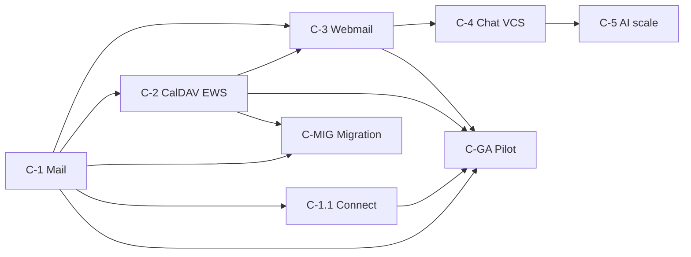

# ERA Communications — индекс исполняемых этапов

**Версия:** 1.0  
**Дата:** 7 июля 2026 г.  
**Приёмка:** [`Comms-Acceptance-System.md`](products/Comms-Acceptance-System.md)

---

## 1. Карта этапов (8 волн)

| # | Wave | Spec | Backlog | F-C / AC | Gate | Статус |
|---|------|------|---------|----------|------|--------|
| 1 | **C-1** | [`MVP-Comms-Mail-Sprint-1-Spec.md`](MVP-Comms-Mail-Sprint-1-Spec.md) | CM1-* | F-C1…F-C7 · AC-C1,C3,C4,C7 | `.\scripts\run-comms-stage-gate.ps1 -Stage C-1` | [x] |
| 2 | **C-1.1** | [`Comms-Stage-C1.1-Spec.md`](Comms-Stage-C1.1-Spec.md) | CM2-* | F-C11 · AC-C6 | `.\scripts\run-comms-stage-gate.ps1 -Stage C-1.1` | [x] |
| 3 | **C-2** | [`Comms-Stage-C2-Spec.md`](Comms-Stage-C2-Spec.md) | CM3-* | F-C12,F-C13 · AC-C8,C9 | `.\scripts\run-comms-stage-gate.ps1 -Stage C-2` | [x] |
| 4 | **C-3** | [`Comms-Stage-C3-Spec.md`](Comms-Stage-C3-Spec.md) | CM4-* | F-C14,F-C15 · AC-C2,C5 | `.\scripts\run-comms-stage-gate.ps1 -Stage C-3` | [x] |
| 5 | **C-4** | [`Comms-Stage-C4-Spec.md`](Comms-Stage-C4-Spec.md) | CM5-* | F-C21…F-C23 · Phase 2 | `.\scripts\run-comms-stage-gate.ps1 -Stage C-4` | [x] |
| 6 | **C-5** | [`Comms-Stage-C5-Spec.md`](Comms-Stage-C5-Spec.md) | CM6-* | F-C31,F-C32 · Phase 3 | `.\scripts\run-comms-stage-gate.ps1 -Stage C-5` | [x] |
| 7 | **C-MIG** | [`Comms-Stage-CMIG-Spec.md`](Comms-Stage-CMIG-Spec.md) | CM-MIG-* | F-C16…F-C16d · AC-MIG-1…5 | `.\scripts\run-comms-stage-gate.ps1 -Stage C-MIG` | [x] |
| 8 | **C-GA** | [`Comms-Stage-CGA-Spec.md`](Comms-Stage-CGA-Spec.md) | CM-GA-* | все MVP AC + пилот | `.\scripts\run-comms-stage-gate.ps1 -Stage C-GA` | [~] scaffold; field pending — см. [`Comms-Pilot-Gap-List.md`](Comms-Pilot-Gap-List.md) |

| 9 | **R-GOV** | [`PRD-Comms-Gov-Protocols.md`](products/PRD-Comms-Gov-Protocols.md) | CM-GOV-* | AC-GOV-* · gov pilot | field RT-01…09 | [ ] |

**Программа scaffold:** 8/8 волн C-* закрыты auto-gate. **Gov pilot:** P0 + P0-GOV + field sign-off. · **Gap до реального пилота:** [`Comms-Pilot-Gap-List.md`](Comms-Pilot-Gap-List.md)

---

## 2. Правила перехода между этапами

1. **C-1** — стартовый этап (без предусловий).
2. **C-1.1** и **C-2** — стартуют только после **gate C-1 = PASS** (G1…G6).
3. **C-3** — после **C-1** и **C-2** (webmail опирается на mail + CalDAV/EWS hooks).
4. **C-4** — после **C-3** (Phase 2; отдельный PRD при необходимости).
5. **C-5** — после **C-4** (может готовиться параллельно с пилотом, но gate C-5 независим).
6. **C-MIG** — после **C-1** и **C-2** (опциональный upsell migration; не блокирует MVP GA).
7. **C-GA** — только когда **C-1, C-1.1, C-2, C-3** = `[x]` (MVP-scope); C-4/C-5/C-MIG не блокируют MVP GA, но отражаются в edition roadmap.



---

## 3. Шаблон §Stage Gate (обязателен в каждом spec)

Копировать в конец каждого stage-spec; подставить `C-X` и wave ID.

```markdown
## N. Stage Gate (обязательно перед закрытием)

| # | Проверка | Доказательство | Статус |
|---|----------|----------------|--------|
| G1 | Авто-тесты этапа | `.\scripts\run-comms-stage-gate.ps1 -Stage C-X` | [ ] |
| G2 | E2E §4 выполнен (лог/скрин) | `reports/comms-stage-CX-e2e.log` | [ ] |
| G3 | Comms-Implementation-Matrix обновлена | PR diff `docs/Comms-Implementation-Matrix.md` | [ ] |
| G4 | Comms-MVP-Spec wave → [x] | PR diff `docs/Comms-MVP-Spec.md` | [ ] |
| G5 | editions-comms.yaml (если edition) | `go test ./services/platform/licensegate/...` | [ ] |
| G6 | Signoff-запись | `reports/comms-stage-CX-signoff.md` | [ ] |
```

**Правило:** этап помечается `[x]` только если G1…G6 закрыты. Для **C-GA** G6 — подпись PO/заказчика.

Генерация signoff-шаблона:

```powershell
.\scripts\run-comms-stage-gate.ps1 -Stage C-1 -WriteSignoff
```

---

## 4. Быстрые команды

| Действие | Команда |
|----------|---------|
| Gate текущего этапа (C-1) | `.\scripts\run-comms-stage-gate.ps1 -Stage C-1` |
| Legacy acceptance (C-1 unit/smoke) | `.\scripts\run-comms-acceptance.ps1` |
| CH integration (F-C4) | `go test ./services/comms/mail/internal/audit/... -tags integration -count=1` |
| Пилот checklist | [`Comms-Pilot-Readiness-Checklist.md`](Comms-Pilot-Readiness-Checklist.md) |

---

## 5. Связано

- [`Comms-MVP-Spec.md`](Comms-MVP-Spec.md)
- [`products/PRD-Comms-MVP.md`](products/PRD-Comms-MVP.md)
- [`products/ERA-Communications-Vision.md`](products/ERA-Communications-Vision.md)
