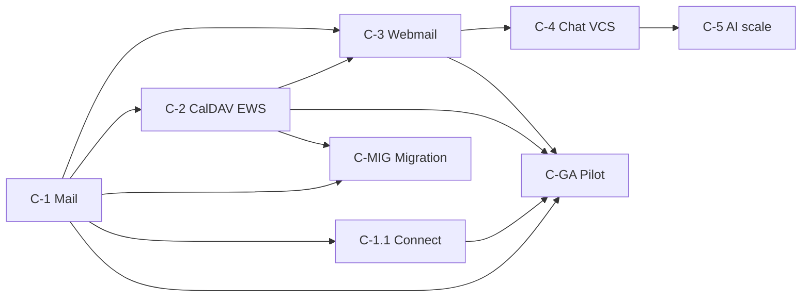

# ERA Communications — индекс исполняемых этапов

**Версия:** 1.0  
**Дата:** 7 июля 2026 г.  
**Приёмка:** [`Comms-Acceptance-System.md`](products/Comms-Acceptance-System.md)

---

## 1. Карта этапов (8 волн)

| # | Wave | Spec | Backlog | F-C / AC | Gate | Статус |
|---|------|------|---------|----------|------|--------|
| 1 | **C-1** | [`MVP-Comms-Mail-Sprint-1-Spec.md`](MVP-Comms-Mail-Sprint-1-Spec.md) | CM1-* | F-C1…F-C7 · AC-C1,C3,C4,C7 | `.\scripts\run-comms-stage-gate.ps1 -Stage C-1` | [x] re-gate PASS 2026-07-29 · `reports/comms-stage-C-1-20260729-235925.log` (CH SKIP) |
| 2 | **C-1.1** | [`Comms-Stage-C1.1-Spec.md`](Comms-Stage-C1.1-Spec.md) | CM2-* | F-C11 · AC-C6 | `.\scripts\run-comms-stage-gate.ps1 -Stage C-1.1` | [x] PASS `…C-1.1-20260729-235840.log` |
| 3 | **C-2** | [`Comms-Stage-C2-Spec.md`](Comms-Stage-C2-Spec.md) | CM3-* | F-C12,F-C13 · AC-C8,C9 | `.\scripts\run-comms-stage-gate.ps1 -Stage C-2` | [x] PASS `…C-2-20260729-235843.log` |
| 4 | **C-3** | [`Comms-Stage-C3-Spec.md`](Comms-Stage-C3-Spec.md) | CM4-* | F-C14,F-C15 · AC-C2,C5 | `.\scripts\run-comms-stage-gate.ps1 -Stage C-3` | [x] PASS `…C-3-20260729-235850.log` |
| 5 | **C-4** | [`Comms-Stage-C4-Spec.md`](Comms-Stage-C4-Spec.md) | CM5-* | F-C21…F-C23 · Phase 2 | `.\scripts\run-comms-stage-gate.ps1 -Stage C-4` | [x] PASS `…C-4-20260729-235903.log` (scaffold) |
| 6 | **C-5** | [`Comms-Stage-C5-Spec.md`](Comms-Stage-C5-Spec.md) | CM6-* | F-C31,F-C32 · Phase 3 | `.\scripts\run-comms-stage-gate.ps1 -Stage C-5` | [x] PASS `…C-5-20260729-235914.log` (scaffold) |
| 7 | **C-MIG** | [`Comms-Stage-CMIG-Spec.md`](Comms-Stage-CMIG-Spec.md) | CM-MIG-* | F-C16…F-C16d · AC-MIG-1…5 | `.\scripts\run-comms-stage-gate.ps1 -Stage C-MIG` | [x] PASS `…C-MIG-20260729-235852.log` |
| 8 | **C-GA** | [`Comms-Stage-CGA-Spec.md`](Comms-Stage-CGA-Spec.md) | CM-GA-* | все MVP AC + пилот | `.\scripts\run-comms-stage-gate.ps1 -Stage C-GA` | [~] scaffold gates OK; **RT-09 field pending** |

## 1b. Волны R-* (gov pilot P0)

| # | Wave | Spec | GAP | Gate | Статус |
|---|------|------|-----|------|--------|
| R-0 | **R-0** | ADR-0029 · [`Comms-Stage-R-Index.md`](Comms-Stage-R-Index.md) | P0-40 prep | schema + specs | [~] specs in git; re-verify after restore |
| R-1 | **R-1** | [`Comms-Stage-R1-Persistence-Spec.md`](Comms-Stage-R1-Persistence-Spec.md) | P0-01…04 | restart test | [~] code restored; integration pending |
| R-2 | **R-2** | [`Comms-Stage-R2-Protocols-Spec.md`](Comms-Stage-R2-Protocols-Spec.md) | P0-10…14 | TLS+AUTH smoke | [~] re-gate via C-1 cargo |
| R-GOV | **R-GOV** | [`Comms-Stage-R-GOV-Spec.md`](Comms-Stage-R-GOV-Spec.md) | GOV-01…07 | golden + staging | [~] unit golden in mail; field open |
| R-3 | **R-3** | [`Comms-Stage-R3-Webmail-Spec.md`](Comms-Stage-R3-Webmail-Spec.md) | P0-20…24 | OIDC + webmail | [~] `ui/mail` restored |
| R-4 | **R-4** | [`Comms-Stage-R4-Deploy-Spec.md`](Comms-Stage-R4-Deploy-Spec.md) | P0-30…35 | compose + runbook | [~] compose restored |
| R-5 | **R-5** | docs honesty | P0-40…42 | matrix column | [x] 2026-07-29 Evidence-Rules |
| RT | **RT-01…09** | staging + field | — | `run-comms-pilot-*.ps1` | [~] scripts restored; RT-09 SKIP until field |

## 1c. Волны R2-* (Cycle 2 hardening)

| # | Wave | GAP | Gate | Статус |
|---|------|-----|------|--------|
| R2-A | Schema + repo | P0-01…02 | `go test -tags=integration .../repo` | [~] restored |
| R2-B | MinIO blobs | P0-01 | blob threshold + readyz | [~] restored |
| R2-C | TLS + SMTP policy | P0-10…14 | `cargo test -p era-mail-core` TLS e2e | [~] re-gate |
| R2-D | Compose + remote E2E | P0-30, RT-01…08 | compose config + staging script | [~] compose config valid |
| R2-E | Gov protocols | GOV-01…07 | golden + WBXML | [~] unit tests in mail |
| R2-F | Webmail + OIDC PG | P0-20…23 | `go test era/ui/mail/...` | [~] restored |
| R2-G | CI + ops + field | P0-30…42, RT-09 | CI `comms-pilot` job | [~] RT-09 field pending |

## 1d. Волны партнёрских продуктов (post-MVP)

| # | Wave | Spec | Backlog | Gate | Статус |
|---|------|------|---------|------|--------|
| BR-1 | **Outlook Bridge** | [`Comms-Outlook-Bridge-Spec.md`](Comms-Outlook-Bridge-Spec.md) | BR-1…8 | `go test -C services/comms/mail-bridge ./...` | [x] unit PASS 2026-07-29; field ⏸ · edition **mvp** |
| MIG-P0 | **Migration production** | [`Comms-Migration-Vendor-Matrix.md`](Comms-Migration-Vendor-Matrix.md) | GAP-P1-10…15 | `go test -C services/comms/migration ./...` | [x] C-MIG PASS 2026-07-29; field cutover ⏸ · edition **mvp** |
| **MIG-CG-IW** | **CG/Lotus→IceWarp brief** | [`Comms-Migration-CG-Lotus-IceWarp-Brief.md`](Comms-Migration-CG-Lotus-IceWarp-Brief.md) | G1…G8 pre-pilot gates | discovery CSV + pilot | [~] docs; field open |
| **P3-FIELD** | **Customer RT-09** | [`Comms-Customer-Field-RT09.md`](Comms-Customer-Field-RT09.md) | A1…A6 | `run-comms-pilot-field.ps1 -SignOff` | [~] tooling restored; sign-off open |
| **P3-BR** | **Exchange + 100mb** | [`Comms-Bridge-100-Mailbox-Runbook.md`](Comms-Bridge-100-Mailbox-Runbook.md) | BR-5,8 | `go test .../exchange/...` | [~] re-proof |
| **P3-MIG** | **1k pilot + calendar** | [`Comms-Migration-1k-Pilot.md`](Comms-Migration-1k-Pilot.md) | C1…C7 | `run-comms-migration-pilot-1k.ps1` | [~] script restored |
| **P4-SCALE** | **40k worker farm** | [`Field-Server-Sizing.md`](Field-Server-Sizing.md) | A1…A6 | `run-comms-scale-40k.ps1` | [~] dry-run script restored |
| **P4-GA** | **Partner bundle** | [`Comms-Partner-Edition-Bundle.md`](Comms-Partner-Edition-Bundle.md) | B1…B5 | `comms-sbom-gate.ps1` | [~] docs |
| **P4-UPSELL** | **IceWarp→ERA** | [`Comms-Upsell-IceWarp-to-ERA-Runbook.md`](Comms-Upsell-IceWarp-to-ERA-Runbook.md) | C1…C3 | icewarp source tests | [~] unit in migration |
| **C-MM** | **Mail Moderation** | [`Comms-Stage-CMM-Spec.md`](Comms-Stage-CMM-Spec.md) | CM-MM-1…12 · AC-MM-1…10 | `.\scripts\run-comms-stage-gate.ps1 -Stage C-MM` | [x] 2026-07-29 |
| **C-MM-H** | **MM Hardening** | [`Comms-Stage-CMM-H-Spec.md`](Comms-Stage-CMM-H-Spec.md) | MM-H-1…8 | `.\scripts\run-comms-stage-gate.ps1 -Stage C-MM-H` | [x] 2026-07-29 |
| **C-MM-P1** | **MM P1** | [`Comms-Stage-CMM-P1-Spec.md`](Comms-Stage-CMM-P1-Spec.md) | MM-P1-1…3 | `go test -C services/comms/mail-moderation ./...` | [x] 2026-07-29 |

**Предусловие BR-1:** P0-GOV field smoke (Outlook EWS) PASS. Upstream matrix: **Accepted 2026-07-09**.  
**Предусловие MIG-P0:** vendor matrix **Accepted 2026-07-09** ([`Comms-Migration-Vendor-Matrix.md`](Comms-Migration-Vendor-Matrix.md) §9).

| 9 | **R-GOV** | [`PRD-Comms-Gov-Protocols.md`](products/PRD-Comms-Gov-Protocols.md) | CM-GOV-* | AC-GOV-* · gov pilot | field RT-01…09 | [x] subset implemented |

**Программа:** код восстановлен из stash (2026-07-29). Re-gate C-1…C-5/C-MIG/C-MM-H = PASS.  
**Evidence:** [`Comms-Evidence-Rules.md`](Comms-Evidence-Rules.md) · [`Comms-Implementation-Matrix.md`](Comms-Implementation-Matrix.md) · [`Comms-Phase2-Roadmap-Evidence.md`](Comms-Phase2-Roadmap-Evidence.md) · RT-09: [`reports/comms-rt09-skip.md`](../reports/comms-rt09-skip.md)

---

## 2. Правила перехода между этапами

1. **C-1** — стартовый этап (без предусловий).
2. **C-1.1** и **C-2** — стартуют только после **gate C-1 = PASS** (G1…G6).
3. **C-3** — после **C-1** и **C-2** (webmail опирается на mail + CalDAV/EWS hooks).
4. **C-4** — после **C-3** (Phase 2; отдельный PRD при необходимости).
5. **C-5** — после **C-4** (может готовиться параллельно с пилотом, но gate C-5 независим).
6. **C-MIG** — после **C-1** и **C-2** (опциональный upsell migration; не блокирует MVP GA).
7. **C-GA** — только когда **C-1, C-1.1, C-2, C-3** = `[x]` (MVP-scope); C-4/C-5/C-MIG не блокируют MVP GA, но отражаются в edition roadmap.


```mermaid
flowchart LR
  C1[C-1 Mail]
  C11[C-1.1 Connect]
  C2[C-2 CalDAV EWS]
  C3[C-3 Webmail]
  C4[C-4 Chat VCS]
  C5[C-5 AI scale]
  CMIG[C-MIG Migration]
  CGA[C-GA Pilot]

  C1 --> C11
  C1 --> C2
  C2 --> C3
  C1 --> C3
  C3 --> C4
  C4 --> C5
  C1 --> CMIG
  C2 --> CMIG
  C1 --> CGA
  C11 --> CGA
  C2 --> CGA
  C3 --> CGA
```

---

## 3. Шаблон §Stage Gate (обязателен в каждом spec)

Копировать в конец каждого stage-spec; подставить `C-X` и wave ID.

```markdown
## N. Stage Gate (обязательно перед закрытием)

| # | Проверка | Доказательство | Статус |
|---|----------|----------------|--------|
| G1 | Авто-тесты этапа | `.\scripts\run-comms-stage-gate.ps1 -Stage C-X` | [ ] |
| G2 | E2E §4 выполнен (лог/скрин) | `reports/comms-stage-CX-e2e.log` | [ ] |
| G3 | Comms-Implementation-Matrix обновлена | PR diff `docs/Comms-Implementation-Matrix.md` | [ ] |
| G4 | Comms-MVP-Spec wave → [x] | PR diff `docs/Comms-MVP-Spec.md` | [ ] |
| G5 | editions-comms.yaml (если edition) | `go test ./services/platform/licensegate/...` | [ ] |
| G6 | Signoff-запись | `reports/comms-stage-CX-signoff.md` | [ ] |
```

**Правило:** этап помечается `[x]` только если G1…G6 закрыты. Для **C-GA** G6 — подпись PO/заказчика.

Генерация signoff-шаблона:

```powershell
.\scripts\run-comms-stage-gate.ps1 -Stage C-1 -WriteSignoff
```

---

## 4. Быстрые команды

| Действие | Команда |
|----------|---------|
| Gate текущего этапа (C-1) | `.\scripts\run-comms-stage-gate.ps1 -Stage C-1` |
| Legacy acceptance (C-1 unit/smoke) | `.\scripts\run-comms-acceptance.ps1` |
| CH integration (F-C4) | `go test ./services/comms/mail/internal/audit/... -tags integration -count=1` |
| Пилот checklist | [`Comms-Pilot-Readiness-Checklist.md`](Comms-Pilot-Readiness-Checklist.md) |

---

## 5. Связано

- [`Comms-MVP-Spec.md`](Comms-MVP-Spec.md)
- [`products/PRD-Comms-MVP.md`](products/PRD-Comms-MVP.md)
- [`products/ERA-Communications-Vision.md`](products/ERA-Communications-Vision.md)
- [`adr/0028-era-mail-client-strategy.md`](adr/0028-era-mail-client-strategy.md)
