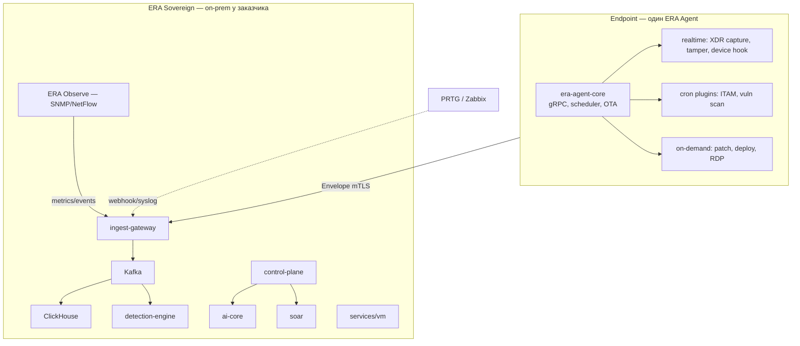

# ERA One — видение единой платформы (endpoint + IT + SecOps)

**Версия:** 1.0  
**Дата:** 9 июня 2026 г.  
**Статус:** Vision / roadmap (не в разработке; старт после exit пилота **ERA XDR Sovereign GA**)  
**Контекст:** обсуждение с Gemini + архитектурная проработка ERA; дополняет, не заменяет текущий GA.

**Связанные документы:**  
[`Production-GA-Spec.md`](Production-GA-Spec.md) · [`ADR-0003`](adr/0003-repository-structure-and-donor-strategy.md) · [`ADR-0005`](adr/0005-module-independence-and-packaging.md) · [`ADR-0009`](adr/0009-pii-redaction-and-agent-budget.md) · [`Market-Positioning-AZ.md`](Market-Positioning-AZ.md)

---

## 1. Зачем этот документ

Когда команда решит выйти за рамки **ERA XDR** (SecOps) к **единой платформе** endpoint + IT Ops + network observability, этот файл — **единая точка входа**: продуктовая модель, архитектура агента, доноры, издания развёртывания (Sovereign / Cloud / Hybrid), репозиторий, порядок работ.

**Не делаем сейчас:** реализация отложена до закрытия пилота XDR ([`Pilot-Readiness-Checklist.md`](Pilot-Readiness-Checklist.md)).

---

## 2. Продуктовая иерархия (именование)

> **Бренд-слоган:** **ONE AGENT. ONE PLATFORM. ONE CONTROL.**

| Уровень | Название | Что это |
|---|---|---|
| **Компания / зонтик** | **ERA One** | Бренд и монорепо всей экосистемы |
| **Endpoint** | **ERA Agent** (core + plugins) | Один installer на хост; модули по лицензии |
| **Издание SecOps** | **ERA XDR** | Ingest, detection, cases, AI, SOAR — *текущий GA* |
| **Издание IT Ops** | **ERA Manage** | ITAM/CMDB + финансовый ITAM, deploy/patch, App Control, Device Control (USB), BitLocker, EPM-lite (будущее) |
| **Издание Service** | **ERA Service** | ITSM-lite: сервис-деск, портал, SLA (будущее) |
| **Издание Provision** | **ERA Provision** | OS provisioning: PXE/imaging bare-metal (будущее) |
| **Издание PAM** | **ERA PAM** | Сейф паролей (vault), SSH/RDP-прокси, запись привилегированных сессий (будущее) |
| **Издание Network** | **ERA Observe** | Agentless SNMP/NetFlow/discovery (аналог PRTG/Zabbix) |
| **Bundle для тендера** | **ERA Unified** / **ERA Sovereign Stack** | XDR + Manage + Service + Observe on-prem |

> **Разводка терминов (важно для продаж):** **ERA Core** — это база *XDR* (агент-телеметрия + ingest + storage + detection + assets + cases), **не** Manage. **ERA Manage** — отдельное издание IT-Ops поверх ядра. **ERA PAM** — отдельное серверное издание (другая категория продукта, как Password Manager Pro у ManageEngine).

**Важно:** **ERA XDR — не «плагин агента»**. XDR — **серверное издание** + **realtime-слой capture** на агенте. ITAM/patch/deploy — **плагины агента** + сервер **Manage**.

---

## 3. Два мира: SecOps vs IT Ops (и зачем PRTG)

| | **ERA XDR / SecOps** | **PRTG / IT Ops / Observe** |
|---|---|---|
| **Вопрос** | «Кто атакует, что запустилось, инцидент?» | «Жив ли свитч, хватит ли места, SLA порта?» |
| **Где данные** | Endpoint (агент) + корреляция | Сеть «без ОС»: SNMP, Ping, NetFlow |
| **Архитектура** | Agent + data lake + detection | Core server + probes, **agentless** |
| **Связка** | **Интеграция обязательна** — иначе слепая зона на железе и IoT |

**Вывод:** свой **полный клон PRTG** — отдельный продукт (**ERA Observe**), не модуль внутри XDR. Для первых контрактов быстрее **интеграция** (webhook/syslog/Kafka) с уже установленным PRTG/Zabbix.

---

## 4. Архитектура платформы (целевая)



---

## 5. Единый агент: Core + плагины

### 5.1. Принцип (согласовано с Gemini, ADR-0009)

- **Один installer** (MSI/deb), **не зоопарк** из 5–6 отдельных агентов.
- **era-agent-core** — всегда в памяти: канал на сервер, auth, планировщик, OTA, маршрутизация команд.
- **Плагины** — отдельные **микро-бинарники** (Rust) или subprocess: core делает `exec`, забирает stdout/JSON, шлёт в Envelope.
- **Lazy load:** плагин не resident, если не нужен → steady-state RAM минимален.
- **Лицензия:** control-plane / license gate включает модуль → core скачивает и запускает только разрешённое ([`ADR-0005`](adr/0005-module-independence-and-packaging.md)).

### 5.2. Три режима работы модулей

| Режим | Когда | Примеры | RAM (ориентир) |
|---|---|---|---|
| **Real-time (24/7)** | Безопасность, перехват | XDR capture, tamper, USB policy (kernel) | +5–30 МБ к core |
| **Scheduled (cron)** | Раз в N часов/сутки | ITAM inventory, vuln scan (local CVE match) | **~0** между запусками |
| **On-demand (event/command)** | Команда с CP / триггер | patch job, deploy MSI, remote session | **0** до команды |

**Планировщик (Scheduler)** в core:

- cron из policy bundle (CP);
- jitter (не все хосты в 00:00);
- budget guard: если CPU/RAM > ADR-0009 → отложить cron, не трогать realtime.

### 5.3. Текущее состояние vs целевое

| Компонент | Сейчас (`crates/era-agent`) | Целевое |
|---|---|---|
| Core loop | `capture → sanitize → buffer → gRPC` | + scheduler + plugin exec + OTA |
| XDR capture | ✅ Win/Linux/macOS | realtime |
| ITAM / patch / deploy | ❌ | cron / on-demand plugins |
| Plugin crates | ❌ | `crates/era-plugin-*` |
| License-gated load | на сервере | + policy на agent |

---

## 6. Пять направлений на endpoint (+ feasibility)

⚠️ = **в одном агенте реально**, но MVP/on-demand, не уровень Ivanti/SCCM/CrowdStrike.

| # | Направление | Режим | «Тонко» в одном агенте | Steady RAM | Как далеко (честно) | Серверная часть |
|---|---|---|---|---|---|---|
| 1 | **ITAM** — инвентаризация | cron | ✅ после orchestrator | +0–5 МБ | CMDB, лицензии ПО, usage — **Manage** | control-plane / CMDB |
| 2 | **Patch & vuln scan** | cron + on-demand | vuln ✅; patch ⚠️ | on-demand | Не SCCM за 1 релиз; cred scan — **VM** | `services/vm`, patch policy |
| 3 | **EPM / Software distribution** | on-demand | deploy ⚠️; full EPM ❌ | on-demand | EPM (JIT admin) — **отдельная линия** | Manage |
| 4 | **ITSM & Remote Desktop** | server + on-demand | ITSM ✅ на сервере; RDP ⚠️ | on-demand | RDP — отдельный security review | cases, SOAR; RDP tunnel |
| 5 | **Device control & DLP** | realtime / policy | USB policy ⚠️ | +10–30 МБ если kernel | Full DLP — **Perimeter** edition | `services/dlp` |
| 6 | **Application Control** (allow/deny запуска) | realtime / policy | enforcement ⚠️ (kernel) | +5–15 МБ | WDAC/AppLocker (Win), eBPF-LSM/fapolicyd (Linux); не SCCM-policy за релиз | control-plane policy + ADR-0012 |
| 7 | **Disk encryption** (BitLocker mgmt) | on-demand | ✅ через OS API | ~0 между запусками | full FDE-suite (LUKS, FileVault) — позже | control-plane key escrow |

### 6.1. Кратко по каждому направлению

**1) ITAM** — snapshot: OS, hardware, installed software, serials → JSON → Envelope → assets/CMDB. Раз в 12–24 ч.

**2) Patch & vuln** — local inventory vs NVD/CVE (**данные**, не код донора); patch = signed package с **локального mirror** (MinIO), reboot policy; credentialed scan — **`services/vm`**.

**3) EPM / deploy** — silent install по команде CP; EPM (privilege elevation, JIT) — позже, высокий risk.

**4) ITSM / RDP** — тикеты и cases уже на платформе; RDP/WebRTC — отдельный бинарник по кнопке админа.

**5) Device / DLP** — USB allow/deny, события в Envelope; контент-DLP — perimeter, не лёгкий агент.

**6) Application Control** — белые/чёрные списки запуска. **Важно:** агент перестаёт быть telemetry-only и получает **enforcement-режим** (блокировка запуска), что требует kernel-уровня (WDAC/AppLocker на Win, eBPF-LSM/fapolicyd на Linux) и отдельного security-review — см. [`ADR-0012`](adr/0012-agent-enforcement-mode.md). Policy приходит из control-plane, нарушения едут в Envelope (detection).

**7) BitLocker / disk encryption** — on-demand плагин активирует нативное шифрование ОС (WMI/PowerShell на Windows) и безопасно передаёт **ключ восстановления** в серверный escrow (control-plane). Сам криптоалгоритм — в ОС; мы делаем оркестрацию и хранение ключей (требование секретов/air-gap, ADR-0009).

---

## 7. Доноры по направлениям (ADR-0003)

**Правило:** паттерны и алгоритмы — да; **код** — переписываем на Rust/Go. **AGPL/GPL** — только идеи, **без копирования исходников**. **Sigma/NVD/MITRE** — данные, проверять лицензию корпуса.

| Направление | Донор (reference) | Лицензия | Что берём |
|---|---|---|---|
| **Agent core / plugins** | Telegraf, Elastic Agent | MIT / Elastic License | Plugin I/O model, lifecycle |
| **XDR capture (Linux)** | Tracee, Falco docs | Apache 2.0 | eBPF event model (переписать) |
| **XDR capture (Windows)** | Sysmon schema, ETW docs | — / MS docs | Event IDs, поля |
| **ITAM** | osquery, Fleet | Apache 2.0 / MIT | Набор полей inventory, query model |
| **CMDB (server)** | Snipe-IT | AGPL | **Только** схема активов, не код |
| **Vuln scan** | Vuls, OpenSCAP | AGPL / LGPL | Workflow CVE match; код — свой |
| **Patch / RMM** | Tactical RMM | AGPL | **Только** deploy workflow |
| **Package mgmt** | Chocolatey, apt | Apache / GPL ecosystem | Форматы пакетов, не форк |
| **Remote desktop** | Guacamole architecture | Apache 2.0 | Протокол/туннель; не RustDesk (AGPL) |
| **Device / USB** | OS policy docs (WDP, udev) | — | Модель policy |
| **Application Control** | WDAC/AppLocker docs, fapolicyd, Falco | MS docs / GPL / Apache 2.0 | Модель policy и enforcement-хуки (переписать) |
| **BitLocker / FDE** | MS BitLocker WMI docs, sd-mgmt | MS docs | API оркестрации, формат key-escrow |
| **PAM (ERA PAM)** | HashiCorp Vault, Teleport, Guacamole | MPL/BUSL/Apache 2.0 | Модель vault/секрет-движков, session-proxy (только идеи, код — свой) |
| **DLP** | — | — | Perimeter module; OpenDLP — идеи only |
| **Network Observe** | Prometheus snmp_exporter, Telegraf snmp | Apache 2.0 / MIT | SNMP input pattern |
| **Discovery** | Nmap | GPL | **Не встраивать**; external tool или свой ping/sweep |
| **NetFlow** | goflow, pmacct docs | BSD/MIT | Flow record parsing (переписать) |
| **Full NMS** | LibreNMS, Zabbix | GPL/AGPL | **Не код**; UI/alerting ideas |

---

## 8. ERA Observe (свой «PRTG») vs интеграция

### 8.1. Два пути

| Путь | Срок (фокус, AI-assisted) | Когда выбирать |
|---|---|---|
| **A. Интеграция** PRTG/Zabbix → ingest | 2–4 недели | У клиента уже есть NMS; первые пилоты |
| **B. ERA Observe** (свой модуль) | 6–12+ месяцев | Стратегия «единый локальный вендор IT+Sec» |

### 8.2. Scope ERA Observe (MVP)

- Discovery: ping sweep, ARP (осторожно с сетевыми политиками).
- SNMP poll (MIB: ifTable, CPU, memory).
- NetFlow/sFlow ingest (optional).
- Alerts → Kafka → detection-engine / cases.
- **Не в MVP:** 200+ sensor types PRTG, полный UI NMS.

### 8.3. Архитектура Observe

- **Agentless** — Go-сервис `services/observe` (или `services/network-monitor`).
- **Не** внутри `era-agent` — другой профиль нагрузки (SNMP flood vs endpoint).
- CMDB merge с ITAM: **MAC, IP, hostname, agent_id** — dedup на control-plane (TBD в ADR).

### 8.4. Интеграция внешнего PRTG (быстрый старт)

1. PRTG notification → **HTTP webhook** → ingest-gateway / dedicated adapter.
2. Или **Syslog** → parser → Envelope (`domain=network`).
3. Правила корреляции: «PRTG: high egress» + «XDR: suspicious process on same host».

---

## 9. OTA, mirror и P2P

| Механизм | Назначение | Приоритет |
|---|---|---|
| **Signed artifacts** на **локальном MinIO** (air-gap) | Обновление core + plugins | **P0** |
| **Content-addressed cache** (hash → blob) | Основа для будущего P2P | P1 |
| **P2P LAN distribution** | Rollout плагинов без WAN | **P2–P3**; часто **запрещён** в банках |

**P2P:** сильная фишка для campus/factory; для SCSS/банка pitch — «**зеркало в контуре**», P2P — опция.

---

## 10. Репозиторий: один монорепо

**Решение:** всё в **одном git-репозитории** ([`ADR-0003`](adr/0003-repository-structure-and-donor-strategy.md)).

| Вопрос | Ответ |
|---|---|
| Отдельный repo на ITAM / Observe? | **Нет** (пока одна команда, один proto, один bundle) |
| Переименовать `era-xdr` → бренд? | **Сделано:** бренд **ERA One**, code-namespace `era` ([`ADR-0015`](adr/0015-era-one-rebrand-namespace.md)) |
| Вложить `era-xdr/` как подпапку? | **Нет** — лишний слой; лучше flat monorepo |
| Когда вынос `era-agent` в отдельный repo? | Отдельная подпись/релиз-train — **позже** |

### 10.1. Целевое дерево (ориентир)

```
era-one/                         # репо (code-namespace `era`, ADR-0015)
├── proto/era/v1/                # Envelope — source of truth
├── crates/
│   ├── era-agent-core/          # orchestrator (split from era-agent)
│   ├── era-plugin-inventory/
│   ├── era-plugin-vulnscan/
│   ├── era-plugin-installer/
│   └── era-collectors/          # OT/Modbus stub
├── services/
│   ├── ingest-gateway/          # ERA XDR
│   ├── detection-engine/
│   ├── control-plane/
│   ├── ai-core/
│   ├── soar/
│   ├── vm/
│   ├── observe/                 # ERA Observe (future)
│   ├── dlp/
│   └── adapters/                # PRTG webhook, syslog (future)
├── deploy/
│   ├── docker-compose.prod.yml
│   ├── docker-compose.prod-ha.yml
│   └── helm/
├── docs/
│   └── ERA-Platform-Vision.md   # этот файл
└── data/                        # Sigma, CVE feeds (air-gap bundle)
```

---

## 11. Издания развёртывания: Sovereign, Cloud, Hybrid

Три **deployment models** — не три разных продукта, а **профили** одной платформы (+ feature flags).

### 11.1. Таблица Sovereign vs Cloud vs Hybrid

| Критерий | **ERA Sovereign** | **ERA Cloud** | **ERA Hybrid** |
|---|---|---|---|
| **Целевой клиент AZ** | Госсектор, банк, SCSS, air-gap | Mid-market, филиалы, «нет своего ЦОД» | Банк: данные дома, SOC managed |
| **Где data lake (CH, Kafka)** | ЦОД **заказчика** | ЦОД **вендора** (region) | **У заказчика** (или private cloud AZ) |
| **Где control-plane / UI** | On-prem | SaaS multi-tenant | CP/UI в облаке **или** on-prem |
| **Агент → куда шлёт** | Local ingest | `ingest.*.era.az` | Local ingest **или** cloud relay |
| **Лицензия** | Offline Ed25519 ([ADR-0010](adr/0010-licensing-and-activation.md)) | Subscription + metering | Contract + offline **или** hybrid billing |
| **PII** | Редакция на агенте | **Ещё строже** (вендор = processor) | Редакция на агенте до границы |
| **Phone-home** | **Запрещён** | Enrollment, updates, billing | Минимальный egress, контракт |
| **ISO / pen-test** | Заказчик + вендор roadmap | **SOC 2 / ISO у вендора** обязательно | Оба контура |
| **PRTG / Observe** | On-prem Observe **или** интеграция | Managed Observe | Local Observe + cloud XDR UI |
| **AI (LLM)** | Ollama on-prem | Hosted vLLM в tenant | Local LLM **или** private cloud |
| **Главный pitch** | Суверенность, данные в стране | Быстрый старт, Opex | Данные дома, операции у вендора |
| **Статус ERA** | **GA (текущий фокус)** | Vision / Phase 2+ | Vision / Phase 2+ |

### 11.2. Что доработать для Cloud (summary)

1. **Hard multi-tenancy** — ingest, CH, MinIO, CP, AI, SOAR (quota, isolation audit).
2. **Identity** — SAML/OIDC, org/workspace, agent enrollment per tenant.
3. **Billing/metering** — nodes, events/s, retention, modules.
4. **Regional K8s** — deploy, DR, KMS, backup.
5. **Ops** — 24/7 SRE, SLA, status page.
6. **Build profile** — `sovereign` vs `cloud` без нарушения air-gap invariants в Sovereign build.

### 11.3. Hybrid (рекомендация для банков) — детально в [`ADR-0018`](adr/0018-hybrid-connected-operating-model.md)

**Sovereign Hybrid** = суверенный **data plane** у заказчика + гибридный **control plane**
у вендора. Сырьё, lake, LLM, кейсы, PII — всегда в контуре; наружу идут только лицензии,
обновления контента, health и (opt-in) обезличенные IoC.

```
[ Агенты ] → [ Local ingest + CH + LLM + cases ]      ── data plane: не покидает контур
                        ↑
[ control-plane ] ─ [ hybrid_relay (модуль) ] ──outbound HTTPS──▶ [ ERA Cloud Portal ]
                     (lease · updates · CRL · health · opt-in TI)   (control plane вендора)
```

Ключевые решения ([`ADR-0018`](adr/0018-hybrid-connected-operating-model.md)):

- **Режимы:** `air-gap` (default) · `connected`/hybrid (явное включение). `connected` = «умеет
  ходить к вендору»; **opt-in** = какие классы данных разрешены (health / TI-share).
- **Relay — модуль `control-plane`** (не отдельный контейнер в MVP): единственный outbound,
  egress allowlist, audit «что ушло», mTLS + подпись контента.
- **Health — 3 уровня policy** (A Minimal / B Operational / C Support break-glass); сырьё,
  PII и кейсы наружу **не уходят никогда**.
- **TI-share (opt-in):** только IoC / detection-metadata / FP-feedback после PII-редакции.
- **Лицензия:** offline Ed25519 ([`ADR-0010`](adr/0010-licensing-and-activation.md)) + **lease**
  (короткий срок, продление через Portal, при обрыве — grace, без kill-switch). Сроки/grace —
  в настройках, без хардкода (старт: lease 30 / renew 24 ч / grace 30 / offline_max 90).
- **Именованные компоненты:** **ERA Cloud Portal** (лицензии/lease, CRL, health, зонтик) ·
  **ERA Update Service** (доставка Sigma/CVE/коннекторов/AI-паков) · **ERA Hybrid Relay**
  (outbound-only модуль в контуре) · **ERA Managed View** (пульт для вендора/MSSP **без
  доступа к lake/кейсам**). Детали — [`ADR-0018 §1.1`](adr/0018-hybrid-connected-operating-model.md).
- **AZ-контекст:** режим «hybrid minimal» (lease + updates + CRL, health A, TI off) + DPA +
  схема потоков; Portal region AZ/EU или self-hosted для госа.
- **BYO-EDR ≠ hybrid:** BYO-EDR — чужой EDR в наш lake (ADR-0017); hybrid — канал к вендору.

**MVP Hybrid-0:** `connected_mode` + lease-renew + update-channel (pull) + CRL + health A +
Portal v0 + DPA/схема потоков для AZ. Полный multi-tenant SaaS — **вне scope** (ступень 4).

---

## 12. Карта изданий (editions) ADR-0005 + расширение

| Издание | Содержимое | Deployment |
|---|---|---|
| **ERA Core** | agent, ingest, storage, detection, assets, cases | Sovereign / Cloud / Hybrid |
| **ERA Control AI** | ai-core | все |
| **ERA Response** | soar | все |
| **ERA Vuln** | vm, vuln plugin | все |
| **ERA Manage** *(new)* | ITAM/CMDB + **финансовый ITAM** (контракты, лицензии, TCO), deploy, patch policy, **Application Control**, **Device Control (USB)**, **BitLocker mgmt**, **EPM-lite** | в основном Sovereign |
| **ERA Service** *(new)* | ITSM-lite: сервис-деск, портал, SLA, привязка к CMDB (полная ITIL-модель, узкий UI — на вырост) | Sovereign |
| **ERA Provision** *(new)* | OS provisioning: PXE/TFTP + образы + unattended-установка, post-install регистрация агента | Sovereign |
| **ERA PAM** *(new)* | **Vault** (сейф паролей/секретов), checkout креденшелов, **SSH/RDP-прокси**, запись привилегированных сессий (на базе `services/dlp`) | в основном Sovereign |
| **ERA Observe** *(new)* | SNMP/NetFlow/discovery | Sovereign; SaaS optional |
| **ERA Federated / National** | опции | Sovereign |
| **ERA Workbench** *(ADR-0017)* | единый incident timeline в Core UI | все |
| **ERA Exposure** *(ADR-0017)* | локальный risk/exposure score | все |
| **ERA BYO-EDR Hub** *(ADR-0017)* | ingest сторонних EDR | Sovereign / Hybrid |

> **Вне продукта (ADR-0016):** **MDM / Mobile UEM** (iOS/Android) — отклонено
> (облачные push-шлюзы вендоров несовместимы с air-gap); **VPN / ZTNA** — не в core
> (доступ через внешнюю сеть ортогонален air-gap; при необходимости — интеграция).
> Триаж разрывов с Ivanti — [`ADR-0016`](adr/0016-uem-scope-vs-ivanti.md).

---

## 13. Дорожная карта (когда возьмётесь)

Оценка — **фокусные недели** (ты + AI), **после** пилота XDR; не календарь с параллельными продажами.

**Поправка на AI-разработку (Cursor + агенты):** ускоряется то, что упирается в **написание кода** (plugin-логика на нашем стеке); НЕ ускоряется то, что упирается во **внешние процессы** — подпись драйверов (WHQL), security-review, крипто-аудит, и **пилот** на air-gap-контуре заказчика (фиксированные недели). Поэтому ниже две колонки: код vs review/подпись/пилот.

| Фаза | Содержание | Код (AI-assisted) | Review / подпись / пилот |
|---|---|---|---|
| **P0** | Exit пилот ERA XDR Sovereign | — | сейчас |
| **P1** | `era-agent-core` orchestrator + scheduler + OTA skeleton | 2–4 нед | — |
| **P2** | Plugin ITAM + CMDB API ([`ADR-0011`](adr/0011-cmdb-itam-data-model.md)) + **финансовый ITAM** (контракты/лицензии/TCO); plugin vuln scan (local) | 2–4 нед | — |
| **P2b** | **Application Control** enforcement ([`ADR-0012`](adr/0012-agent-enforcement-mode.md)): policy-движок + WDAC/eBPF-LSM хуки | 2–4 нед (policy быстро) | **+драйвер-подпись + security-review (календарное)** |
| **P2c** | **BitLocker mgmt**: on-demand плагин + key escrow в control-plane | 1–2 нед | + проверка хранения ключей (ADR-0009) |
| **P3** | PRTG/Zabbix adapter; правила корреляции network+endpoint | 1–2 нед | — |
| **P4** | Plugin deploy (simple); patch jobs; MinIO mirror | 3–6 нед | + пилот rollout |
| **P4p** | **ERA PAM** MVP: vault + checkout + session recording (на базе `services/dlp`); SSH/RDP-прокси | 4–8 нед | **+крипто-аудит (vault/HSM) — обязателен** |
| **P5** | ERA Observe MVP (SNMP + discovery) | 4–8 нед | — |
| **P6** | **Device Control** USB policy (OS-specific, enforcement [`ADR-0016`](adr/0016-uem-scope-vs-ivanti.md)); RDP on-demand; EPM-lite (JIT admin) | по ADR | + security-review |
| **P6s** | **ERA Service** (ITSM-lite): сервис-деск, портал, SLA, привязка к CMDB; ITIL-модель данных | 3–6 нед | — |
| **P6p** | **ERA Provision**: PXE/TFTP + образы + unattended-установка; post-install регистрация агента | 3–6 нед | + пилот rollout |
| **P2x** | **ERA Workbench** + **ERA Exposure** + **BYO-EDR Hub** ([`ADR-0017`](adr/0017-vision-one-onprem-patterns.md)) | 4–8 нед | golden multi-source timeline |
| **P2b+** | **Virtual Patching** в ERA Manage (mitigation до патча ОС) | 3–5 нед | + driver sign + security-review |
| **P7h** | **Sovereign Hybrid MVP (Hybrid-0)** ([`ADR-0018`](adr/0018-hybrid-connected-operating-model.md)): `connected_mode` + Relay-модуль + lease-renew + update-channel (pull) + CRL + health A + Portal v0 | 4–8 нед | + ops (Portal) + DPA/схема потоков AZ |
| **P7** | ERA Cloud MVP (multi-tenant SaaS) — **только по спросу** | 4–8 нед | + ops/SRE |

**Не параллелить** P1 и пилот XDR без отдельного инженера. **Критические гейты** (не ускоряются кодом): подпись драйвера App Control (P2b), крипто-аудит vault (P4p).

---

## 14. С чего начать (checklist старта Platform phase)

- [ ] Пилот XDR Sovereign подписан ([`Pilot-Readiness-Checklist.md`](Pilot-Readiness-Checklist.md)).
- [x] ADR: **Platform Agent Orchestrator** (scheduler, plugin ABI, OTA) — [`ADR-0019`](adr/0019-platform-agent-orchestrator.md) (Implemented).
- [ ] ADR: **Deployment editions** (Sovereign / Cloud / Hybrid build tags).
- [x] ADR: **Sovereign Hybrid — connected operating model + lease** — [`ADR-0018`](adr/0018-hybrid-connected-operating-model.md) (Accepted).
- [x] ADR: **CMDB / модель данных ITAM** — [`ADR-0011`](adr/0011-cmdb-itam-data-model.md) (Proposed).
- [x] ADR: **Agent enforcement mode** (Application Control) — [`ADR-0012`](adr/0012-agent-enforcement-mode.md) (Proposed).
- [x] ADR: **ERA PAM** (vault, секрет-движки, session-proxy) — [`ADR-0013`](adr/0013-era-pam-edition.md) (Proposed).
- [x] Rebrand → **ERA One**, code-namespace `era`, proto `era.v1`, лицензия `ERA1` ([`ADR-0015`](adr/0015-era-one-rebrand-namespace.md)). Физический rename папки репо `era-xdr` → `era-one` — вручную (git).
- [x] ADR: **UEM scope vs Ivanti** — Service/Provision/Device Control/Financial ITAM; MDM/VPN out ([`ADR-0016`](adr/0016-uem-scope-vs-ivanti.md)) (Accepted).
- [x] Split `crates/era-agent` → `era-agent-core` + first plugin `era-plugin-inventory` — [`Agent-Core-Spec.md`](Agent-Core-Spec.md).
- [x] CMDB merge rules (MAC / hostname / agent_id) — [`ADR-0011`](adr/0011-cmdb-itam-data-model.md), Этап 5.
- [ ] Choose: **интеграция PRTG** (P3) vs **Observe** (P5) first.

---

## 15. Связь с текущим ERA XDR GA

| Уже есть | Используем в Platform |
|---|---|
| `crates/era-agent` capture, buffer, mTLS, tamper | Основа **realtime** core |
| `services/*` XDR stack | Издание **ERA XDR** |
| `services/vm` | Vuln / cred scan server |
| `services/dlp` | Perimeter / advanced DLP |
| `control-plane` assets, license gate | CMDB + module toggles |
| `ui/portal/` | SOC UI (расширить multi-tenant для Cloud) |
| `deploy/helm`, prod compose | Sovereign; base для Cloud K8s |

---

## 16. Резюме одной фразой

**ERA One** — один **лёгкий модульный агент** (realtime + cron + on-demand) и **набор серверных изданий** (XDR, Manage, PAM, Observe) в **одном монорепо**, поставляемых как **Sovereign** (приоритет AZ), **Hybrid** (банки) или **Cloud** (будущее), с **интеграцией PRTG** на старте и **ERA Observe** как стратегической опцией полного network monitoring.

---

*Документ подготовлен для внутреннего планирования. При старте реализации — перевести ключевые решения в ADR и обновить [`Development-Plan.md`](Development-Plan.md).*
