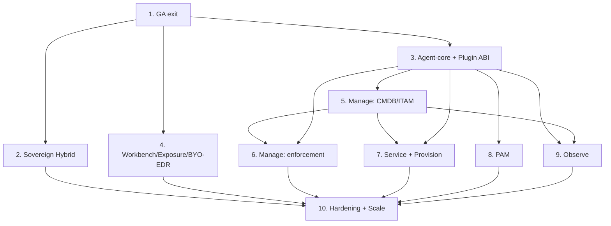

# ERA One — Implementation Roadmap (Platform phase)

**Версия:** 1.1
**Дата:** 2 июля 2026 г.
**Статус:** Активный — верхнеуровневый план из 10 этапов; пошаговые планы — в `.cursor/plans/`.

Единый источник верхнеуровневой последовательности реализации **после** Functional MVP
(Фазы 0–4) и в ходе Production GA. Связывает стратегию
([Vision](ERA-Platform-Vision.md), [Blueprint](../reports/ERA-XDR-Architecture-Blueprint.md))
с ADR и Definition of Done по каждому этапу.

Связано: [Development-Plan.md](Development-Plan.md) · [Production-GA-Spec.md](Production-GA-Spec.md) ·
[editions-control.yaml](../editions-control.yaml) · [ADR-Implementation-Matrix.md](ADR-Implementation-Matrix.md) (сверка ADR↔код)

---

## Отправная точка (факт по коду)

**Построено (soft-complete, идёт приёмка GA):** суверенное ядро — `era-agent`, `era-agent-core`,
`era-plugin-inventory`, `ingest-gateway`, `control-plane`, `detection-engine`, `ai-core`, `soar`, `vm`,
`waf/ngfw/dlp`, `federated/national-hub`, `compliance`, `license`.
Hybrid-0: `hybrid_relay` (модуль CP), `cloud-portal`, `update-service` (ADR-0018).

**Не построено (предмет post-GA / pre-pilot):** зрелый FP-workflow и analyst suppression
([`ADR-0022`](adr/0022-detection-content-governance.md) Фаза 2), MITRE runtime map на алертах,
forensic-grade AI audit trail ([`ADR-0023`](adr/0023-ai-investigation-explainability.md) Фаза 2),
tamper prevent на уровне ядра (ADR-0006 Фаза 2, [gate: WHQL]).

---

## Последовательность (10 этапов, по слоям/модулям)

| # | Этап | Слой / модуль | Гейт (кроме кода) | Зависит от | План-файл |
|---|---|---|---|---|---|
| 1 | GA exit | Продукт (Core+AI+Response) | пилот + подпись checklist [field] | — | `stage_1_ga_exit` |
| 2 | Sovereign Hybrid (Hybrid-0) | Control / Ops | ops (Portal) + DPA/схема AZ | 1 | `stage_2_sovereign_hybrid` |
| 3 | Agent-core + Plugin ABI | Агент (фундамент) | — | 1 | `stage_3_agent-core_plugin_abi` |
| 4 | Workbench + Exposure + BYO-EDR | Analytics / UI | golden multi-source timeline | 1 | `stage_4_workbench_exposure_byo-edr` |
| 5 | ERA Manage — ядро (ITAM/CMDB) | IT-Ops | — | 3 | `stage_5_era_manage_cmdb_itam` |
| 6 | ERA Manage — enforcement | Агент | подпись драйвера + security-review [gate] | 3, 5 | `stage_6_era_manage_enforcement` |
| 7 | ERA Service + Provision + deploy/patch | IT-Ops | пилот rollout [field] | 3, 5 | `stage_7_era_service_provision_deploy` |
| 8 | ERA PAM | PAM | крипто-аудит vault/HSM [gate] | 3 | `stage_8_era_pam` |
| 9 | ERA Observe | Сеть | — | 3, 5 | `stage_9_era_observe` |
| 10 | Упрочнение и масштаб | Cross-cutting | scale/soak на кластере [field] | 2–9 | `stage_10_hardening_and_scale` |

Статусы: `[ ]` todo · `[~]` в работе · `[x]` готово · `[blocked]` заблокировано.

| Этап | Статус | Доказательство |
|---|---|---|
| 1 GA exit | [~] софт-proof | `reports/ga-full-20260701-151724.log` PASS; loadgen 10k + пилот → [blocked: Этап 10] |
| 2 Sovereign Hybrid | [x] Hybrid-0 MVP | `go test` license/control-plane/update-service/cloud-portal — PASS; [Hybrid-0-Spec](Hybrid-0-Spec.md) |
| 3 Agent-core + Plugin ABI | [x] | `cargo test -p era-agent-core -p era-agent` — PASS; [Agent-Core-Spec](Agent-Core-Spec.md) |
| 4–5 | [x] | Workbench/CMDB specs + тесты PASS |
| 6 Manage enforcement | [x] monitor-ready | `docs/Enforcement-Spec.md`; cargo/go tests PASS |
| 7 Service+Provision+deploy | [x] | `docs/Service-Provision-Spec.md`; go/cargo tests PASS |
| 8 ERA PAM | [x] | `docs/PAM-Spec.md`; `go test ./services/pam/...` PASS; HSM/RDP → [gate: external] |
| 9 ERA Observe | [x] | `docs/Observe-Spec.md`; `go test ./services/observe/...` PASS |
| 10 Hardening | [x] soft | `docs/Hardening-Scale-Spec.md`; `scripts/ci-gates-stage10.ps1` PASS; soak/scale cluster → [gate: field] |

---

## Граф зависимостей

Жёсткая цепочка: 3 → 5 → 6/7. Параллелимы после зависимостей: 2, 4, 8, 9.

---

## Этапы (кратко)

### Этап 1 — GA exit
Локальный proof-трек: prod-стек + `run-ga-full`/`run-loadgen-prod`/`run-pilot-local`,
логи в `reports/`, заполнить [Pilot-Readiness-Checklist](Pilot-Readiness-Checklist.md),
свести статусы. Полевые пункты (реальный пилот, pen-test, 7×24) → `[blocked: field]`.
**DoD:** софт-приёмка PASS, loadgen proof (или sizing-вывод), sign-off обновлён.

### Этап 2 — Sovereign Hybrid (Hybrid-0)
[ADR-0018](adr/0018-hybrid-connected-operating-model.md) §12: `hybrid_relay` (модуль
control-plane, outbound-only), lease поверх [ADR-0010](adr/0010-licensing-and-activation.md),
Update Service v0, Cloud Portal v0 + Managed View (RBAC), CRL pull, health A.
Инвариант: сырьё/PII/кейсы наружу никогда. Connected OFF по умолчанию.
**DoD:** connected e2e через mTLS, golden (lease/CRL/bundle/health-redaction), air-gap не сломан.

### Этап 3 — Agent-core + Plugin ABI
[Vision §5/§9](ERA-Platform-Vision.md) + новый **ADR-0019**: split `era-agent` →
`era-agent-core` (scheduler/OTA/license-gate/budget-guard) + subprocess plugin ABI
(NDJSON→Envelope) + `era-plugin-sdk` + первый `era-plugin-inventory`. OTA-скелет
(подпись через `era-license`, локальное зеркало).
**DoD:** inventory-плагин e2e, тесты scheduler/license-gate/OTA, бюджет ADR-0009 (bench).

### Этап 4 — Workbench + Exposure + BYO-EDR `[x]`
[ADR-0017](adr/0017-vision-one-onprem-patterns.md) §1–§3 (§4 Virtual Patching → Этап 6):
timeline API (merge по case/node/correlation) + UI; exposure per-asset (CVE+детекты+
критичность) + топ-10; BYO-EDR адаптеры (JSON/syslog → Envelope).
**DoD:** golden multi-source timeline, exposure-ранжирование, BYO-EDR feed в Workbench.
**Факт:** `docs/Workbench-Exposure-Spec.md`; `go test` event-writer/detection-engine/control-plane; `cargo test -p era-collectors` PASS.

### Этап 5 — ERA Manage: CMDB/ITAM + финансовый `[x]`
[ADR-0011](adr/0011-cmdb-itam-data-model.md): полный inventory-snapshot →
`domain=inventory` → двухслойно (CMDB current-state в control-plane + история в CH);
merge/dedup (`agent_id`>serial>MAC>hostname); финансовый ITAM (контракты/лицензии/TCO);
`asset_software` → vm.
**DoD:** e2e inventory→CMDB, golden merge, reconciliation installed vs entitled.
**Факт:** `docs/CMDB-ITAM-Spec.md`; merge golden PASS; `go test` control-plane/ingest/vm; `cargo test` era-plugin-inventory.

### Этап 6 — ERA Manage: enforcement `[x]`
[ADR-0012](adr/0012-agent-enforcement-mode.md) + [ADR-0016 §2](adr/0016-uem-scope-vs-ivanti.md)
+ [ADR-0017 §4](adr/0017-vision-one-onprem-patterns.md): общий policy-движок + App Control +
Device Control (USB) + Virtual Patching (резидентные) + BitLocker (on-demand, key escrow).
Обязательный `monitor` перед `enforce`, fail-open.
**Гейт [external]:** подпись драйвера, security-review, полевой monitor-soak.
**DoD:** код до monitor + golden allow/deny + fuzz policy; боевой enforce за гейтом.
**Факт:** `docs/Enforcement-Spec.md`; `cargo test -p era-agent-core` + plugins PASS; `go test` control-plane enforcement PASS.

### Этап 7 — ERA Service + Provision + deploy/patch `[x]`
[ADR-0016 §3/§4](adr/0016-uem-scope-vs-ivanti.md): `service-desk` (полная ITIL-модель,
узкий MVP-UI, связь с CMDB/SLA); `provision` (PXE/образы MinIO/unattended/post-install
enroll); Manage deploy/patch (on-demand, подписанные пакеты с зеркала).
**Гейт [field]:** пилот-rollout. **DoD:** ITSM-поток + PXE-демо + deploy подписанного пакета.
**Факт:** `docs/Service-Provision-Spec.md`; `go test` service-desk/provision/control-plane; `cargo test -p era-plugin-deploy` PASS.

### Этап 8 — ERA PAM `[x]`
[ADR-0013](adr/0013-era-pam-edition.md): суверенный vault (at-rest, мастер-ключ в
HSM/KMS-абстракции, seal/unseal Shamir, zero-knowledge), checkout (RBAC+approval+TTL),
session-proxy SSH/RDP (инжект креденшелов + запись, расширение `dlp`), аудит в custody.
**Гейт [external]:** крипто-аудит vault/HSM, security-review RDP.
**DoD:** vault seal/unseal + checkout + SSH-сессия с записью; no-secret-leak gate.
**Факт:** `docs/PAM-Spec.md`; `go test ./services/pam/...` PASS.

### Этап 9 — ERA Observe (A + B) `[x]`
[Vision §8](ERA-Platform-Vision.md) + **ADR-0020**: (A) интеграция PRTG/Zabbix
(webhook/syslog → `domain=network`) + корреляция `era-observe-network-endpoint`; (B) нативный
`services/observe` (SNMP poll sim + discovery sim + NetFlow line); CMDB reconciliation сетевых устройств.
**DoD:** интеграция-feed в lake + нативный SNMP/discovery + unmanaged-asset в CMDB.
**Факт:** `docs/Observe-Spec.md`; `go test ./services/observe/...` + `networkreconcile` + correlator PASS.

### Этап 10 — Упрочнение и масштаб `[x]` (soft)
Масштаб: compose profile `scale`, `ERA_CONSUMER_GROUP`, loadgen `-agents`, Helm probes/PVC.
Безопасность: `platform/httpserver` (mTLS), `/metrics` на platform-сервисах.
Edition-matrix + CI: `ci-gates-stage10.ps1`, bundle golden, PII/pam gates.
**Факт:** `docs/Hardening-Scale-Spec.md`; `go test` + `ci-gates-stage10.ps1` PASS.
**Гейт [field]:** крупный масштаб и 7×24 soak на кластере.

### Post-GA — Pre-pilot gaps (ADR-0022 / ADR-0023) `[ ]`

Зафиксировано 2 июля 2026 г. после экспертного ревью (госсектор / SSPS-class вопросы).
Не блокирует field-прогон AC2, но **блокирует заявление «зрелый SOC»** без оговорок.

| ID | Тема | ADR | DoD (кратко) | Статус |
|---|---|---|---|---|
| PP-1 | Sigma→MITRE runtime на detection | 0022 | теги правила → `mitre_techniques` на алерте + golden | [ ] |
| PP-2 | Analyst suppression / FP UI | 0022 | per-tenant suppress + FP mark → CP API + UI | [ ] |
| PP-3 | MITRE coverage heatmap | 0022 | UI + отчёт по корпусу | [ ] |
| PP-4 | CVE content pipeline | 0022 | `data/cve-feed/` + e2e apply в VM | [~] kind есть |
| PP-5 | AI investigation audit log | 0023 | immutable record: who/when/model_version | [ ] |
| PP-6 | Evidence chain verdict→custody | 0023 | `investigate` → custody seal per event_id | [ ] |
| PP-7 | Attack graph в Workbench | 0023 | визуализация цепочки на timeline | [ ] |
| PP-8 | Tamper prevent (kernel) | 0006 §1.B | Фаза 2 за WHQL-гейтом | [blocked: external] |

**Связано:** [`ADR-Implementation-Matrix.md`](ADR-Implementation-Matrix.md) §«Темы pre-pilot».

---

## Сводка гейтов (не ускоряются кодом)

| Гейт | Тип | Этап |
|---|---|---|
| Реальный пилот + подпись checklist, pen-test | field | 1 |
| Ops Portal + DPA/схема потоков AZ | ops/legal | 2 |
| Подпись драйвера (WHQL/нотаризация) + security-review хуков | external | 6 |
| Пилот-rollout provision/deploy | field | 7 |
| Крипто-аудит vault/HSM + security-review RDP | external | 8 |
| Крупный масштаб + 7×24 soak на кластере | field | 10 |

---

## Новые ADR (пишутся внутри своих этапов)

- **ADR-0019** — Platform Agent Orchestrator (scheduler, plugin ABI, OTA) — Этап 3.
- **ADR-0020** — Network Observe + CMDB reconciliation — Этап 9.
- **ADR-0021** — Публичный продуктовый портал + калькулятор — маркетинг.
- **ADR-0022** — Detection Content Governance (Sigma, MITRE, TI, FP) — Post-GA PP-1..4.
- **ADR-0023** — AI Investigation Explainability & Audit Trail — Post-GA PP-5..7.
- Переводятся `Proposed → Implemented` по ходу: ADR-0011, 0012, 0013, 0017; 0018 `Accepted → Implemented`.

---

## Сознательно отложено (вне 10 этапов)

- **EPM-lite / JIT admin** — отдельная линия ERA Manage (Vision P6).
- **Multi-tenant SaaS** (ступень 4 ADR-0018) — только по подтверждённому спросу.
- **Физический rename репо** `era-xdr → era-one` — ручной git ([Vision §14](ERA-Platform-Vision.md)).
- **MDM/Mobile UEM, VPN/ZTNA** — DECLINE / INTEGRATE-ONLY ([ADR-0016 §5/§6](adr/0016-uem-scope-vs-ivanti.md)).

---

## Принципы

1. Этап N+1 не начинается, пока DoD этапа N не закрыт (или отклонение задокументировано в ADR).
2. Приёмка = доказательство (тест/лог/метрика) — правило `task-acceptance`.
3. Contract-first: изменение proto → codegen → все потребители в одном PR.
4. Инварианты air-gap/PII/лёгкий агент — не нарушаются ни на одном этапе.
5. Пошаговые планы этапов — в `.cursor/plans/` (по одному файлу на этап).
