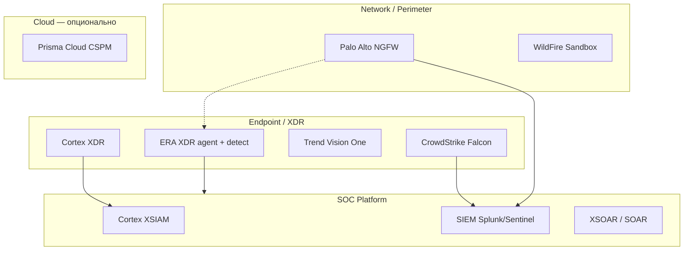

# ERA XDR — Market Positioning (Азербайджан)

**Версия:** 1.0  
**Дата:** 9 июня 2026 г.  
**Статус:** Активный  
**Аудитория:** SCSS, DOST, ЦБ АЗ, банки (Kapital, PASHA), SOCAR, Azerenerji, Azercell, integrators.

Связанные документы: [`Production-GA-Spec.md`](Production-GA-Spec.md), [`ADR-0005`](adr/0005-module-independence-and-packaging.md), [`ADR-0006`](adr/0006-coverage-gaps-strategic-bets-and-practices.md), [`Install-Guide-GA.md`](Install-Guide-GA.md).

---

## 1. Как читать этот документ

Рынок XDR — **не один продукт**, а **слои архитектуры**. Международные вендоры (CrowdStrike, Palo Alto, Trend Micro) продают разные слои; ERA XDR позиционируется как **суверенная on-prem платформа** уровня **Cortex XSIAM / Falcon XDR + SOC**, без экспорта телеметрии в облако.

**Мы не заявляем** (пока нет доказательств):

- FedRAMP High, SOC 2 Type II (как у CS/PA)
- MITRE ATT&CK Evaluations «Leader»
- Поддержку AIX/Solaris/РЕД ОС без пилота
- Замену NGFW Palo Alto PA-Series

**Мы заявляем** (GA-1 целевое):

- On-prem / air-gap: данные в контуре заказчика
- ERA Core + AI + Response (Win+Linux агенты)
- MITRE-mapped Sigma, roadmap Eval/BAS (GA-2)
- Сочетание с **уже установленным Palo Alto NGFW**

---

## 2. Архитектура рынка (слои)



| Слой | Назначение | Типичный вендор |
|---|---|---|
| **Endpoint XDR** | Агент, процессы, файлы, detect, investigate | CrowdStrike, Cortex XDR, ERA |
| **NGFW** | Периметр, IPS, сегментация | Palo Alto PA-Series |
| **Sandbox** | Дetonation неизвестных файлов | WildFire, отдельные AV-lab |
| **SIEM / XSIAM** | Хранение, корреляция, кейсы | XSIAM, Splunk, ERA data lake |
| **SOAR** | Playbooks, block, ticket | XSOAR, ERA Response |
| **Cloud posture** | Misconfig AWS/Azure/K8s | Prisma Cloud |

---

## 3. Сравнение вендоров и ERA

### 3.1 CrowdStrike Falcon

| Аспект | CrowdStrike | ERA XDR |
|---|---|---|
| **Где хранятся данные** | Облако Falcon (исторически AWS); регионы UAE/KSA/India; Gov = FedRAMP | **ClickHouse + MinIO в ЦОД заказчика** |
| **Где AI/корреляция** | Облако | **`ai-core` on-prem** |
| **Агент** | Лёгкий sensor | **`era-agent` Rust, бюджет ADR-0009** |
| **Сертификаты вендора** | ISO 27001, SOC 2 II, FedRAMP High, NIST 800-53 | **Roadmap ISO 27001 компании-разработчика** |
| **Обучение** | Falcon Admin/Responder/Hunter/… | Партнёрский SOC training (TBD) |
| **Для SCSS on-prem** | Риск data sovereignty | **Прямое попадание в требование** |

### 3.2 Palo Alto Networks

| Продукт PA | Что делает | ERA |
|---|---|---|
| **NGFW + Panorama** | Сеть, не EDR | **Не заменяем** — интеграция (логи, block IP из SOAR) |
| **WildFire** | Sandbox | **Нет** — см. §6; опциональная интеграция IoC |
| **Cortex XDR** | EDR | **`era-agent` + `detection-engine`** — конкурент |
| **Cortex XSOAR** | SOAR | **`services/soar`** |
| **Cortex XSIAM** | XDR+SIEM+SOAR | **Вся платформа ERA** (поэтапно GA-1→3) |
| **Prisma Cloud** | CSPM/CNAPP | **GA-3 / P2** — не приоритет чистого on-prem SCSS |

**Сильная связка для заказчика с PA:** `PA NGFW + ERA XDR` (аналог «PA NGFW + CrowdStrike» из типовых enterprise).

### 3.3 Trend Micro

| Продукт | Роль | ERA |
|---|---|---|
| **Apex One** | EPP/EDR, серверы, virtual patching | Не копируем; фокус XDR, не классический AV |
| **Vision One** | XDR, email, cloud correlation | **Референс кросс-домена** (Blueprint) |
| **Cloud One / Email** | Облако, почта | Collectors — post GA-1 |

---

## 4. Матрица «кто что закрывает»

| Функция | CS | PA Cortex | Trend | **ERA GA-1** | **ERA GA-2/3** |
|---|---|---|---|---|---|
| Win/Linux EDR | ✅ | ✅ | ✅ | ✅ | macOS, +OS |
| On-prem data lake | ⚠️ | ⚠️ | ⚠️ | ✅ | HA |
| AI investigate | Cloud | Cloud | Слабее | ✅ heuristic → Ollama (triage) | + audit trail ([ADR-0023](adr/0023-ai-investigation-explainability.md)) |
| SOAR | Partner/Fusion | XSOAR | Ограничено | ✅ (connectors GA-1) | Real mesh |
| NGFW | — | ✅ | — | — | Опция `ngfw` |
| Sandbox | — | WildFire | — | ❌ | Интеграция |
| ITDR | ✅ Identity | ✅ | ⚠️ | Auth events | GA-2 rules |
| Email XDR | Partner | — | ✅ | — | Collectors |
| Cloud CSPM | Falcon Cloud | Prisma | Cloud One | — | GA-3 |
| FedRAMP story | ✅ | ✅ | ✅ | **Суверенность АЗ** | — |

---

## 5. Сертификации для SCSS / ЦБ / банков

### 5.1 Что важно в Азербайджане (приоритет GPT + регулятор)

| Сертификат / артефакт | Для кого | ERA статус |
|---|---|---|
| **AZS ISO/IEC 27001:2022** (ИСМ вендора) | SCSS, ЦБ, все | **Roadmap компании**, не sprint кода |
| **Процессы ISO 2700X у заказчика** | ЦБ строит на семействе ISO | Помогаем **`compliance`** отчётами (GA-2) |
| **MITRE ATT&CK Evaluations** | Техкомиссия | **Sigma + mapping**; Eval/BAS — **GA-2 (S6-18)** |
| **FedRAMP High** | Маркетинг «как у CS» | **Не цель**; замена: on-prem + локальный аудит |
| **SOC 2 Type II** | Cloud SaaS, банки | Вторично для pure on-prem |
| **PCI DSS, ISO 22301, ISO 27701** | Банки | Контур заказчика + privacy (PII на агенте) |

### 5.2 Слайд для SCSS (честный)

**Не копировать слайд CrowdStrike.** Рекомендуемые 4 пункта для ERA:

1. ✅ **On-prem / air-gap** — телеметрия не покидает контур  
2. 🔄 **AZS ISO/IEC 27001** — программа сертификации вендора (дата TBD)  
3. ✅ **MITRE ATT&CK mapping** — Sigma corpus + curated rules  
4. ✅ **Соответствие требованиям ЦБ АЗ** — модуль compliance (roadmap GA-2)

### 5.3 Certification roadmap (отдельный от GA-1 code)

| Этап | Срок (ориентир) | Владелец |
|---|---|---|
| GAP-анализ ISO 27001 | Q3 2026 | ИБ / GRC |
| ISMS документация | Q3–Q4 2026 | ИБ |
| Stage 1 / Stage 2 audit | 2027 | Сертификатор |
| MITRE Eval / BAS pilot | GA-2 | Engineering + SOC |
| Пилот SCSS design partner | GA-1 exit | Sales + Engineering |

---

## 6. Sandbox (WildFire) — зачем нужен и почему нет у ERA

### 6.1 Что такое sandbox в безопасности

**Sandbox (песочница / detonation chamber)** — изолированная среда, куда **отправляют подозрительный файл или URL**, запускают его и **наблюдают поведение**:

- создаёт ли процессы, меняет реестр;
- идёт ли C2-связь;
- шифрует ли файлы (ransomware);
- какой family малware.

**Примеры:** Palo Alto **WildFire**, CrowdStrike Falcon Sandbox, Trend Micro DDAN.

Это **не EDR и не XDR core**. Это **отдельный движок анализа образцов**, результат которого (verdict, IoC, hash) **кормит** XDR/SIEM/NGFW.

### 6.2 Где sandbox в типовой архитектуре

```
Пользователь открыл файл → EDR не уверен → hash unknown
    → NGFW/Email/EDR отправляет в Sandbox
    → Sandbox: malicious
    → Block hash на NGFW + isolate host + IoC в TIP
```

### 6.3 Почему нет в ERA (и это нормально для GA-1)

| Причина | Пояснение |
|---|---|
| **Другой класс продукта** | Нужна VM-ферма, hypervisor isolation, anti-evasion — тяжёлая инфраструктура |
| **Air-gap** | Облачный WildFire = phone-home; on-prem sandbox = отдельный проект (Cuckoo, CAPE, коммерческие appliance) |
| **Не блокер XDR** | Большинство enterprise: **PA WildFire уже есть** при NGFW |
| **ADR scope** | ERA = detect **по поведению на хосте** + корреляция; sandbox = **статический/динамический анализ файла** |

### 6.4 Стратегия ERA для sandbox

| Вариант | Когда | Модуль |
|---|---|---|
| **A. Интеграция** | У заказчика WildFire / локальный sandbox | SOAR playbook «submit hash» + TIP IoC ingest (GA-2) |
| **B. Hash reputation offline** | Air-gap без sandbox | Национальный hub / локальные IoC feeds (ERA National) |
| **C. Свой sandbox** | Крупный гос, бюджет | **Отдельный R&D / партнёр** — не Wave GA-1/2/3 core |

**Вывод для sales:** «Sandbox нет в коробке ERA, потому что это WildFire-class продукт. При PA NGFW WildFire уже закрывает слой; ERA закрывает endpoint + SOC + on-prem AI.»

---

## 7. Рекомендуемые архитектуры для AZ

### A. PA NGFW + ERA XDR (рекомендуем при установленном Palo Alto)

```
[PA NGFW/WildFire] ──logs/IoC──► [ERA ingest → CH → detect → ai-core → soar]
[ERA agent Win/Linux] ──events──►
[SOAR] ──block IP──► [PA API]
```

### B. ERA standalone (greenfield on-prem)

Полный стек Core+AI+Response без замены сетевого периметра (если NGFW другой вендор).

### C. Международный бенчмарк (не для closed SCSS)

PA NGFW + CrowdStrike + Splunk — сильно, но **облако CS** и **3 вендора**.

---

## 8. Поддержка ОС (честная матрица)

| ОС | CS / PA / Trend | ERA |
|---|---|---|
| Windows 10/11, Server | ✅ | **GA-1** |
| RHEL, Ubuntu, Debian, … | ✅ | **GA-1** (auditd) |
| macOS | ✅ | После GA-1 |
| Astra / РЕД ОС / ALT | Проверять отдельно | **Пилот + матрица** |
| AIX, Solaris, HP-UX | ⚠️❌ | **Вне scope v1** |
| K8s / VMware deep | ✅ | GA-3 collectors |

---

## 9. Конкурентные сообщения (one-liner)

| Аудитория | Сообщение |
|---|---|
| **SCSS / DOST** | Суверенный XSIAM в вашем ЦОД: endpoint + lake + AI + response без AWS. |
| **ЦБ / банк** | PII режется на агенте; compliance AZ/CB; ISO 27001 roadmap. |
| **CISO с Palo Alto** | PA остаётся на периметре; ERA — endpoint и SOC-мозг, SOAR стыкуется с NGFW. |
| **Vs CrowdStrike** | Тот же класс detect/investigate, но данные не уходят в Falcon cloud. |
| **Vs Trend Apex** | Не EPP; Vision One-class correlation + локальный AI. |

---

## 10. Связь с roadmap разработки

| Market promise | Sprint / GA |
|---|---|
| Win+Linux prod capture | GA-1 S5-4…S5-6 ✅ |
| Prod deploy | GA-1 S5-3 ✅ |
| Core+AI+Response bundle | GA-1 S5-13…S5-17 |
| mTLS agent→gateway | GA-1 S5-8 |
| MITRE curated 100+ | GA-1 S5-10 (корпус); runtime map — Post-GA [ADR-0022](adr/0022-detection-content-governance.md) |
| ITDR, TIP, tamper detect | GA-2; tamper prevent — WHQL gate |
| Sandbox integration playbook | GA-2 (SOAR + TIP), не свой sandbox |
| Prisma-class CSPM | GA-3 |

---

## 11. Что не обещать на презентации

- FedRAMP / «как CrowdStrike AWS»
- MITRE Eval Leader без прогона
- Замену PA-Series NGFW
- Встроенный WildFire-аналог в GA-1
- macOS / РЕД ОС без пилота
- Полный Vision One (email+cloud) в GA-1
- «99% FP отфильтровано» без field-метрик заказчика
- EPP-grade tamper (kernel prevent) — только detect-and-alert до WHQL
- Forensic-grade AI verdict без custody chain — см. [ADR-0023](adr/0023-ai-investigation-explainability.md)
- Полная Sigma-семантика (Chainsaw-class) — MVP subset, [ADR-0022](adr/0022-detection-content-governance.md)

---

*Документ обновляется при изменении Production-GA-Spec или выходе пилота SCSS. ADR-0022/0023 — 2 июля 2026.*
