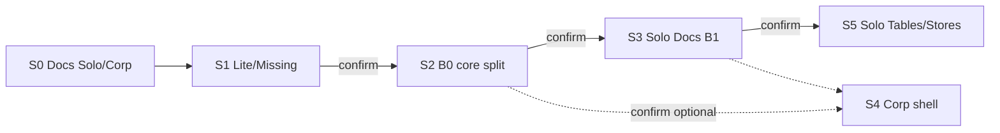

# ERA Office — Roadmap (фазы A / B / C)

**Дата:** 9 июля 2026 г. · **Обновлено:** 3 августа 2026 г.  
**Статус:** Accepted  
**Связано:** [ADR-0026](adr/0026-sovereign-office-engine.md) · [ADR-0025](adr/0025-era-one-shared-platform.md) ·
[Office-MVP-Spec](Office-MVP-Spec.md) · [Office-Sprint-Index](Office-Sprint-Index.md) ·
[ERA-Office-Vision](products/ERA-Office-Vision.md)

---

## 0. Порядок работ с подтверждением (канон исполнения)

Каждый крупный шаг **стартует только после явного подтверждения** владельца продукта/сессии.
Не смешивать шаги в одном коммите «заодно».

| # | Шаг | Цель | Статус | Старт после |
|---|-----|------|--------|-------------|
| **S0** | Документировать Solo / Corporate desktop + матрицу фич | Этот документ §1.1–1.3, §3 | [x] 2026-08-03 | — |
| **S1** | Доработать остатки **Lite / Missing** по Platform Office (браузер) | UX/fidelity Tables·Docs·Pres·Projects·AI | [x] 2026-08-03 P0+P1 | Подтверждение после S0 |
| **S2** | **Полное разделение начинки** (`era-*-core` / server / `StorageBackend`) | B0 — без этого Solo невозможен | [x] 2026-08-03 | Подтверждение после S1 |
| **S3** | Первая **Solo** локальная версия (Documents → Tauri) | B1 — open/save на диск, device license | [x] 2026-08-03 | Подтверждение после S2 |
| **S4** | Corporate desktop shell (опционально параллельно/после S3) | B-corp — Tauri → tenant workspace | [x] 2026-08-03 | Подтверждение отдельно |
| **S5** | Solo Tables / Pres / Stores | B2–B4 | [x] 2026-08-03 B2+B3; **B4 Pres+Projects+SKU [x] 2026-08-03** | После S3 + готовности A2/A3 |

**Правило:** фича, сделанная в S1 в shared UI/core, попадёт в оба десктопа *после* S2–S3 автоматически **только если** она не завязана на сервер. См. §1.3.

---

## 1. Три фазы (сводка)

| Фаза | Название | Клиент | Storage | Co-edit | UI |
|------|----------|--------|---------|---------|-----|
| **A** | **Platform Office** | Браузер (Workspace) | ERA Drive + Postgres | ✅ WebSocket | Web SPA |
| **B** | **Desktop (Tauri)** | Нативное приложение — **два профиля** (§1.1) | Local **или** tenant Drive | Solo ❌ / Corp ✅ | WebView + Rust core |
| **C** | **Native render** | Нативное приложение | Локальный / Drive | ❌* | Собственный рендер (Rust) |

\* Co-edit остаётся на Platform (A и Corporate desktop); LAN/P2P — не в scope MVP.

**Общий инвариант:** один **Rust core** (model, convert, calc) — несколько профилей deployment.

```
                    ┌─────────────────────────┐
                    │   era-*-core (Rust)     │
                    │ model · convert · calc  │
                    └───────────┬─────────────┘
          ┌─────────────────────┼─────────────────────────┐
          ▼                     ▼                         ▼
    ┌───────────┐         ┌───────────┐             ┌───────────┐
    │ Фаза A    │         │ Фаза B    │             │ Фаза C    │
    │ Platform  │         │ Tauri     │             │ Native UI │
    │ server+WS │         │ Solo|Corp │             │ canvas    │
    └───────────┘         └───────────┘             └───────────┘
```

### 1.1. Два десктоп-профиля (фаза B)

Не один бинарь «и так и сяк», а **два SKU / режима** одного Tauri shell:

| | **Solo (локальный)** | **Corporate (к их облаку)** |
|---|----------------------|-----------------------------|
| **Зачем** | PR, кэш, дом, SMB без ЦОД | Сотрудник tenant’а; «как Outlook к Exchange» |
| **Аудитория** | физлица, скачал → работает | корп / гос с on-prem или их SaaS-контуром |
| **Данные** | локальный диск (`.erad` / `.erat` / docx / xlsx) | ERA Drive / URL workspace заказчика |
| **Identity** | почти нет / device license | OIDC tenant, тот же JWT что в браузере |
| **Co-edit** | ❌ нет | ✅ как в фазе A |
| **Лицензия** | per-install / store / offline Ed25519 per device | per-user от их licensegate (как Suite) |
| **Дистрибуция** | Store + direct + EV signing | MDM / internal portal / managed config (`server_url`) |
| **Цена (ориентир)** | отдельная линейка (~€2/product в B) | клиент **к уже купленному** Suite, не второй раз за редактор |

**Инвариант:** Solo **не** требует Postgres, MinIO, Identity, Drive.  
Corporate **не** дублирует calc/co-edit локально в v1 — сервер остаётся source of truth; десктоп = оболочка + OS integration.

### 1.2. Corporate v1 vs Hybrid (позже)

| Вариант | Когда | Суть |
|---------|-------|------|
| **B-corp v1** | После/рядом с Solo B1 | Tauri грузит tenant Workspace URL + SSO (быстрый win для тендеров «нужен desktop») |
| **Hybrid** | Только после стабильных LocalFs + DriveBackend | Локальный core + sync к Drive — отдельный epic, не смешивать с B1 |

### 1.3. Матрица фич: куда попадает доработка

Новые фишки Office **не** обещаются 1:1 во все клиенты. Классификация при дизайне/PR:

| Слой | Browser (A) | Solo desktop | Corporate desktop | Примеры |
|------|-------------|--------------|-------------------|---------|
| **Shared UI + core** | ✅ | ✅ (после S2–S3) | ✅ | форматирование, формулы, borders UI, virtual grid, shell-диалоги |
| **Platform-only** | ✅ | ❌ или local fallback | ✅ | Drive ACL, co-edit WS, protect на сервере, docs-ai → Ollama, share tenant link |
| **Solo-only** | ❌ | ✅ | ❌ | file dialogs, recent local files, demo save limit, device license |
| **OS shell** | частично | ✅ | ✅ (другой config) | ассоциации файлов, deep links, print, notifications |

При каждой крупной фиче в spec/PR указывать строку: **Targets: Browser | Solo | Corporate**.

---

## 2. Фаза A — Platform Office (текущий фокус до S2)

**Аудитория:** гос, банки, корпораты, air-gap контур.  
**Лицензия:** per-user/year ([ERA-Pricing-Office-Client](distributor/ERA-Pricing-Office-Client.md)).

### 2.1. Подфазы

| Подфаза | Deliverable | PRD / Spec | Статус кода |
|---------|-------------|------------|-------------|
| **A0 — P0** | Drive + Workspace + Identity + deploy | [PRD-Office-P0](products/PRD-Office-P0.md) | O-GA gate PASS; field RT-O09 open |
| **A1 — P1** | ERA Documents: `.erad`, docx, co-edit | [PRD-Office-P1](products/PRD-Office-P1.md) | O1-GA PASS; TE-DOC polish |
| **A2 — P2** | ERA Tables: `.erat`, xlsx, formulas, WS | [PRD-Office-P2](products/PRD-Office-P2.md) | engine + UI lab; Lite/Missing → шаг S1 |
| **A3 — P3** | ERA Presentations `.erap` | PRD-Office-P3 | lab / polish |
| **A4 — P4+** | Fidelity, Sign, Office AI | ADR-0026 §4 | AI = air-gap stub / optional Ollama |
| **A4-FMT** | **O-FMT-0…3** MS-class formatting | [Controls Catalog](Office-UI-Controls-Catalog.md) | sequential waves |
| **A2+** | **Wasm scripting (Tables only)** | post-P2 epic | roadmap — **не Documents** |

### 2.2. Компоненты A

| Компонент | Путь |
|-----------|------|
| docs-engine server | `services/platform/docs-engine/` |
| tables-engine | `services/platform/tables-engine/` |
| presentations-engine | `services/platform/presentations-engine/` |
| Drive | `services/platform/drive/` |
| UI | `ui/docs/`, `ui/tables/`, `ui/drive/`, `ui/presentations/`, `ui/projects/`, `ui/office-shell/` |
| Co-edit | WS + Postgres sessions |

### 2.3. Шаг S1 — Lite / Missing (перед core split)

Перед B0 закрывать «времянки» Platform Office, которые стыдно тащить в десктоп:

- остатки `*Lite` UX (chart/sparkline/subtotal/merge depth, Pres master/transitions, Projects Gantt Lite);
- Missing из [Office-UI-Feature-Inventory](Office-UI-Feature-Inventory.md) / Tech-Eval gaps по приоритету пилота;
- не раздувать scope: **не** начинать Tauri в S1.

**S1 P0 (2026-08-03) — сделано:**

| Item | Evidence |
|------|----------|
| Убрать «(lite)» из меню/тостов Tables·Docs·Pres·Projects | `ui/*/index.html`, `era_plus.js`, subtotal/chart status |
| Chart card: title + Clear, persist `set_charts: []` | `ui/tables/web/app.js` |
| Docs in-doc table → WS `delete_range`/`insert_text` + peer `table_cells` refresh | `ui/docs/web/app.js` |
| Drive empty state (folder / search / trash) | `ui/drive/web/app.js` + `office.css` |
| Header/footer strip — нормальный chrome | `#headerStrip` + `.era-header-footer-strip` |

**S1 P1 (2026-08-03) — сделано:**

| Item | Evidence |
|------|----------|
| Chart axes + bar/line picker + empty-range UX | `ui/tables/web/app.js` `drawBarChart` / `renderLiteChart` |
| Docs table − Row / − Col + TOC cleanup | `ui/docs/web/app.js` |
| Spell toolbar icon | `data-icon="spell"` + `icons.js` |
| Tables ↓+100 rows / →+cols labels | `ui/tables/web/index.html` |
| Quiet line-numbers toggle | `ui/docs/web/later.js` |
| TE disclaimer banners + Help → About honesty | `wireTeDisclaimer` + Docs/Tables/Pres/Projects About |
| Pres Morph / Docs columns copy softened | dialogs + Help |
| Projects timeline empty + comments local-only | `ui/projects` |

**S1 = [x].** Дальше — только после подтверждения на **S2**.

### 2.4. Exit criteria A → старт S2 (B0)

- [x] Подтверждение на S2 (после S1) — 2026-08-03
- [ ] Field pilot RT-O09 по возможности (Documents) — желательно, не жёсткий блокер Solo B1
- [x] Рефактор **`era-docs-core`** / **`era-tables-core`** отделены от server crates (= содержание S2)

**S2 P0 (2026-08-03) — сделано:**

| Item | Evidence |
|------|----------|
| `crates/era-docs-core` — model/spans/sync/canonical/convert/wire | `cargo test -p era-docs-core --lib` PASS |
| `crates/era-tables-core` — model/calc/sync/convert/ods | `cargo test -p era-tables-core --lib` PASS |
| `crates/era-office-storage` — `StorageBackend` + `LocalFsBackend` | `cargo test -p era-office-storage --lib` PASS |
| DriveBackend + AppState.storage in docs/tables engines | lib + golden + ws_coedit / ws_sheet_coedit PASS |
| Docker workspace COPY cores | `Dockerfile.docs-engine` / `Dockerfile.tables-engine` |

**S2 = [x].** Дальше — только после подтверждения на **S3** (Solo Documents / Tauri).

### 2.5. Шаг S3 — Solo Documents (B1 vertical)

**S3 (2026-08-03) — сделано:**

| Item | Evidence |
|------|----------|
| `apps/era-office-desktop` Tauri 2 + thin Solo UI | `ui/index.html`, File menu, block editor |
| Path I/O `.erad` + docx import/export | `solo.rs` + `era-docs-core` |
| Demo save-limit (5 blocks) + `office-docs-solo` license | `license.rs` + `ERA_SOLO_LICENSE` |
| Spec | [Office-Stage-S3-Solo-Spec.md](Office-Stage-S3-Solo-Spec.md) |
| Tests | `cargo test -p era-office-desktop --lib` PASS (8); `cargo check -p era-office-desktop` PASS |

**S3 = [x].** Дальше — только после подтверждения на **S4** (Corporate) или **S5** (Solo Tables).

**S4 (2026-08-03) — сделано:**

| Item | Evidence |
|------|----------|
| Profile `solo` / `corporate` + `server_url` persist | `config.rs` + `%Config%/era-office-desktop/config.json` |
| Corporate WebView → tenant Workspace (`/drive/`) | `corp.rs` + `corp_go`; SSO = tenant `/login` |
| Deep link / CLI `era-office://open?…` | `corp::parse_open_url` / `open_target_from_args` |
| First-run profile chooser + Corporate URL setup | `ui/index.html` boot panel |
| Spec | [Office-Stage-S4-Corp-Spec.md](Office-Stage-S4-Corp-Spec.md) |
| Tests | `cargo test -p era-office-desktop --lib` PASS (17); `cargo check -p era-office-desktop` PASS |

**S4 = [x].** Lab demo shell: [Office-Stage-Corp-Lab-Demo.md](Office-Stage-Corp-Lab-Demo.md). Дальше — только после подтверждения на **S5** (Solo Tables / Pres / Stores).

**S5 (2026-08-03) — сделано (B2 + B3 scaffold):**

| Item | Evidence |
|------|----------|
| Solo Tables on `era-tables-core` | `solo_tables.rs` — `.erat` / xlsx / ods |
| Demo cell-cap (25) + `office-tables-solo` | `license.rs` + `ERA_SOLO_LICENSE` |
| UI Documents \| Tables + 20×10 grid | `ui/index.html`, `app.js` |
| Windows bundle scaffold (NSIS) | `tauri.conf.json` `bundle.active`; README; Store checklist in S5 spec |
| Spec | [Office-Stage-S5-Tables-Spec.md](Office-Stage-S5-Tables-Spec.md) |
| Tests / release | `cargo test -p era-office-desktop --lib` PASS (22); `cargo build --release -p era-office-desktop` |

**S5 = [x]** for B2 + B3 + **B4 Solo Presentations / Projects** + Store SKU scaffold.
Store publish / EV — ops checklist in [Office-Stage-Solo-SKU-Distro.md](Office-Stage-Solo-SKU-Distro.md).

**B4 + SKU (2026-08-03) — сделано:**

| Item | Evidence |
|------|----------|
| `era-pres-core` + engine thin wrap | `crates/era-pres-core`; presentations-engine re-exports |
| Solo Pres session + bridge frame-op/export | `solo_pres.rs`; AC-PRE in [Office-Stage-Solo-Pres-Spec.md](Office-Stage-Solo-Pres-Spec.md) |
| `era-projects-core` `.eraj` | `crates/era-projects-core` |
| Solo Projects persist | `solo_projects.rs`; [Office-Stage-Solo-Projects-Spec.md](Office-Stage-Solo-Projects-Spec.md) |
| SKU mode `--sku` / `ERA_OFFICE_SKU` | `sku.rs`; [Office-Stage-Solo-SKU-Distro.md](Office-Stage-Solo-SKU-Distro.md) |
| NSIS matrix script | `scripts/build-office-sku.ps1` + `tauri.conf.sku-*.json` |
| Tests | `cargo test -p era-office-desktop --lib` — 35 PASS; cores PASS |
| Lab pack + smoke | [Lab-Demo](Office-Stage-Solo-Lab-Demo.md); `pack-office-solo-lab.ps1` → `dist/office-solo-lab/`; `smoke-office-solo-lab.ps1` |
| SKU matrix evidence | `build-office-sku-matrix.ps1` → `reports/office-sku-build-*.log` |
| Corporate lab demo | [Corp-Lab-Demo](Office-Stage-Corp-Lab-Demo.md) |

**Solo Docs full UI (2026-08-03) — сделано:**

| Item | Evidence |
|------|----------|
| Embed `ui/docs` via loopback bridge | `solo_bridge.rs` + `solo_docs_go` |
| REST/WS shim on `SoloState` / `era-docs-core` | create/get/snapshot + DocOp apply |
| Solo skin + Open/Save | `assets/solo-docs-boot.js`, `solo-docs-skin.css` |
| Spec | [Office-Stage-Solo-Docs-FullUI.md](Office-Stage-Solo-Docs-FullUI.md) |
| Tests | `cargo test -p era-office-desktop --lib` PASS (25) |

---

## 3. Фаза B — Desktop (Tauri)

### 3.1. Принципы (общие)

- Один shell-код, **два профиля**: Solo и Corporate (§1.1)
- Переиспользование `ui/docs`, `ui/tables`, … в **Tauri WebView**
- Rust core через `invoke()` (Tauri commands)
- Trait **`StorageBackend`**: `LocalFsBackend` (Solo) · `DriveBackend` (Corporate / A)
- **Не Electron** (стек + air-gap / signing проще с Tauri)

### 3.2. Solo — принципы

- **Без** co-edit, Drive, identity server, MinIO, Postgres
- Open / Edit / Save `.erad`, `.docx`, `.xlsx` на локальном диске
- Demo: лимит save → конверсия; Store receipt или offline Ed25519 per device
- Отдельные иконки/SKU в Store предпочтительны для PR («ERA Documents», затем Tables)

### 3.3. Corporate — принципы

- Config: `server_url` (install / first run / MDM)
- Login: OIDC (system browser или WebView) → тот же JWT
- Deep links: `era-office://open?…` из Mail/Drive
- v1 = Workspace в окне Tauri; offline cache / hybrid sync — отдельно (§1.2)

### 3.4. Подфазы B

| Подфаза | Deliverable | Зависимость | Оценка | Шаг |
|---------|-------------|-------------|--------|-----|
| **B0 — Core split** | `era-docs-core`, `era-*-server`; `StorageBackend` | S1 done + confirm | 1–2+ нед | **S2** |
| **B1 — Solo Documents** | Tauri: file dialogs, save/load, device license | B0 + confirm | 6–10 нед | **S3** |
| **B-corp — Corporate shell** | Tauri → tenant URL + SSO | A stable + confirm | 2–4 нед | **S4** |
| **B2 — Solo Tables** | Tauri + tables core | A2 polish + B0 | 6–10 нед | **S5** |
| **B3 — Distribution** | MS Store, Mac App Store, direct + EV signing | B1 | 2–4 нед | **S5** |
| **B4 — Solo Presentations + Projects + Store SKUs** | Pres/Projects depth + NSIS SKU matrix | A3 + B0 | [x] 2026-08-03 | Specs Solo-Pres / Solo-Projects / SKU-Distro |

### 3.5. Структура кода (S2 done)

```
crates/
  era-docs-core/          # model, convert, OpLog, wire (pure)
  era-tables-core/        # grid, calc, xlsx/ods (pure)
  era-office-storage/     # StorageBackend + LocalFsBackend
services/platform/
  docs-engine/            # era-docs-engine — axum, DriveBackend, persist (bin unchanged)
  tables-engine/          # era-tables-engine — axum, DriveBackend (bin unchanged)
apps/
  era-office-desktop/     # Tauri Solo Docs (S3) + Tables (S5) + Corporate shell (S4)
```

Rename packages → `era-*-server` — отложено (Docker/CI bin names стабильны).
### 3.6. Демо / лицензия Solo

- Бесплатная demo: лимит save (напр. 5 страниц) — конверсия в полную лицензию
- Store receipt или offline Ed25519 per device ([ADR-0010](adr/0010-licensing-and-activation.md) паттерн)

---

## 4. Фаза C — Native render (потом)

**Триггер:** WebView bottleneck (perf, print, a11y, «как Word»), tender requirement.

| Подфаза | Deliverable | Оценка |
|---------|-------------|--------|
| **C0 — R&D** | Text shaping (harfbuzz), layout, caret | 3–6 мес |
| **C1 — Documents native view** | Render `.erad` без HTML | 6–12 мес |
| **C2 — Tables native grid** | Virtualized grid 100k+ rows | 6–12 мес |
| **C3 — Shell integration** | Tauri hosts native widget | 2–3 мес |

**Wasm macros:** встраивать в **Tables** (A2+/B2), не блокировать C.

---

## 5. Порядок работ (единая шкала)



**Параллельно допустимо:** S4 (Corporate shell) после S2 без ожидания полного Solo Tables; S1 не блокирует мелкий polish Platform, но **блокирует** старт B0 до подтверждения.

---

## 6. Макросы

| Продукт | Макросы |
|---------|---------|
| **ERA Documents** | ❌ не планируются |
| **ERA Tables** | Wasm sandbox (post-P2), **не VBA parity** |
| Legacy VBA в xlsx | preserve on roundtrip; не выполнять |

---

## 7. Связанные документы

- [ERA-Office-Vision](products/ERA-Office-Vision.md)
- [ERA-Documents-vs-Word](ERA-Documents-vs-Word.md)
- [ERA-Tables-vs-Excel](ERA-Tables-vs-Excel.md)
- [Office-Tech-Eval-Gap-List](Office-Tech-Eval-Gap-List.md)
- [Office-Pilot-Gap-List](Office-Pilot-Gap-List.md)
- [Office-UI-Feature-Inventory](Office-UI-Feature-Inventory.md)
- [Office-Sprint-Index](Office-Sprint-Index.md)
