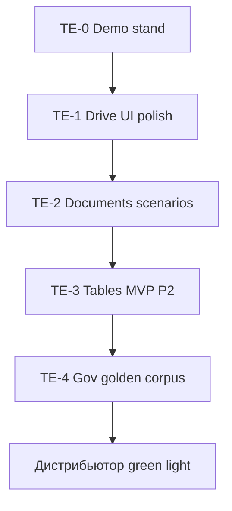

# ERA Office — Tech Eval Strategy (гос. технарь → дистрибьютор)

**Версия:** 1.0  
**Дата:** 8 июля 2026 г.  
**Статус:** Active — **главный приоритет продукта** (выше field pilot RT-O09)  
**Аудитория:** product owner, технарь (ex-gov), инженерия, дистрибьютор

**Связано:** [`Office-Tech-Eval-Checklist.md`](Office-Tech-Eval-Checklist.md) · [`Office-Tech-Eval-Gap-List.md`](Office-Tech-Eval-Gap-List.md) · [`products/PRD-Office-P2.md`](products/PRD-Office-P2.md) · [`ERA-Tables-vs-Excel.md`](ERA-Tables-vs-Excel.md)

---

## 1. Северная звезда

**Цель:** дать технарю **живой продукт**, который можно показать гос. заказчику и сказать: «это уже Office в контуре, не слайды».

**Критерий успеха:** технарь подтверждает «почти продукт» → дистрибьютору можно **открыто** предлагать издания (с честными оговорками по scope).

**Не является целью:** закрытие RT-O09 с подписью заказчика, пока нет Tables и демонстрируемых сценариев.

---

## 2. Два трека (не смешивать)

| Трек | Вопрос | Статус |
|------|--------|--------|
| **INFRA / Pilot** | Можно ли развернуть compose, миграции, license, restart? | ✅ Lab PASS (`office-pilot-staging-*.log`) |
| **PRODUCT / Tech Eval** | Есть ли что показать гос.технарю как Word/Excel/PPT? | 🔴 **активный** — Tables критический путь |

O-Pilot и staging **не заменяют** Tech Eval. Gate PASS ≠ «готов продавать как M365».

---

## 3. Приоритеты (решение product owner, 2026-07-08)

| # | Приоритет | Обоснование |
|---|-----------|-------------|
| **1** | **ERA Tables (P2)** | Без таблиц «нигде не годится» для гос. контура |
| **2** | **ERA Drive (P0) — demo polish** | Файлы, папки, ACL в UI — база любого показа |
| **3** | **ERA Documents (P1) — живые сценарии** | Co-edit + docx на типовых шаблонах (когда появятся) |
| **4** | **ERA Presentations (P3)** | Можно затянуть после Tables |
| **5** | Field pilot RT-O09 | После Tech Eval PASS |

---

## 4. Что показываем технарю сегодня vs целевой TE-v3

| Издание | Сейчас (честно) | Целевой Tech Eval (TE-v3) |
|---------|-----------------|---------------------------|
| **ERA Drive** | Backend ✅, UI базовый | Папки, upload/list, версии, ACL в UI |
| **ERA Documents** | Lite editor, co-edit, узкий docx | Импорт 1–2 гос. шаблона, co-edit 2 пользователя, export |
| **ERA Tables** | Stub `/tables` | Grid, формулы SUM/AVG, xlsx I/O, co-edit ячеек |
| **ERA Presentations** | Нет | Roadmap после TE-v3 |

Позиционирование vs MS: [`ERA-Documents-vs-Word.md`](ERA-Documents-vs-Word.md), [`ERA-Tables-vs-Excel.md`](ERA-Tables-vs-Excel.md).

---

## 5. Волны Tech Eval (исполняемый порядок)



| Волна | Deliverable | Доказательство |
|-------|-------------|----------------|
| **TE-0** | Один compose, runbook, demo tenant | технарь поднимает стенд за 30 мин |
| **TE-1** | Drive: папки + файлы в UI | checklist TE-D* PASS |
| **TE-2** | Documents: 3 живых сценария | checklist TE-DOC* PASS |
| **TE-3** | **Tables MVP** (PRD P2) | checklist TE-T* PASS + golden xlsx |
| **TE-4** | Корпус реальных gov шаблонов docx/xlsx | golden в `testdata/` |
| **TE-sign** | Подпись технаря | [`Office-Tech-Eval-Checklist.md`](Office-Tech-Eval-Checklist.md) §sign-off |

Детальный backlog: [`Office-Tech-Eval-Gap-List.md`](Office-Tech-Eval-Gap-List.md).  
План исполнения P2: [`.cursor/plans/office_tech_eval_p2_tables.plan.md`](../.cursor/plans/office_tech_eval_p2_tables.plan.md).

---

## 6. Честность для дистрибьютора

До **TE-sign** в RFQ и compare **не обещать** полный Suite как M365:

| Можно предлагать | Нельзя обещать как GA |
|------------------|----------------------|
| ERA Drive (mvp) | Excel-уровень формул / макросы |
| ERA Documents (mvp, lite Word) | Полная замена Word |
| ERA Tables — **после TE-3** | PowerPoint до P3 |
| Air-gap, on-prem, ERA Communications hook | Copilot / облако |

Шаблон RFQ: секция MVP vs Suite — [`ERA-RFQ-Office-Template.md`](distributor/ERA-RFQ-Office-Template.md).

---

## 7. Golden corpus (запрос шаблонов)

Когда появятся реальные docx/xlsx от гос./корпоративных заказчиков:

1. Положить в `services/platform/docs-engine/testdata/gov/` (обезличить PII).
2. Добавить golden-тест import → native → export.
3. Обновить TE-DOC / TE-T чеклист «PASS на шаблоне X».

Без корпуса TE-4 блокируется; TE-3 можно закрыть на синтетических fixtures.

---

## 8. Связь с acceptance system

```
PRD P0/P1/P2  →  Office-Tech-Eval-Strategy (этот файл)
                      ↓
              Office-Tech-Eval-Gap-List (TE-*)
                      ↓
              Office-Tech-Eval-Checklist (ручные сценарии)
                      ↓
              Office-Implementation-Matrix (код ↔ тест)
                      ↓
              run-office-stage-gate (регрессия, не sign-off)
```

Field pilot ([`Office-Pilot-Readiness-Checklist.md`](Office-Pilot-Readiness-Checklist.md)) — **после** Tech Eval.
