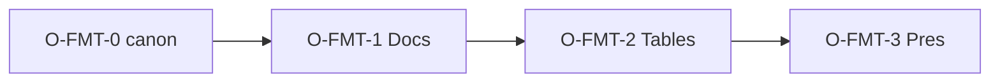

# ERA Office — UI Controls Catalog (live + O-FMT enrichment)

**Дата:** 31 июля 2026 г.  
**Статус:** Active (O-FMT-0)  
**IA:** Google-menubar (не MS Ribbon) · MS/LO = источники *capabilities*  
**Связано:** [Menu-Map](Office-UI-Menu-Map.md) · [Feature-Inventory](Office-UI-Feature-Inventory.md) · [OSS-Delta](Office-OSS-Delta.md) · [Baseline](Office-UI-Baseline.md) · [Sprint-Index](Office-Sprint-Index.md) §2 O-FMT

**Легенда статуса:** `live` · `rec` (в O-FMT) · `later` · `never`  
**Лента** = toolbar под menubar (`era-toolbar`), не Ribbon.



---

## Never (все издания)

| Название | Источник | Почему |
|----------|----------|--------|
| VBA / macros / ActiveX | MS Office | Baseline Never |
| SmartArt / Equations OMML / Drop cap | Word | Не block-model |
| Full Track Changes / Mail merge fields | Word | Suggesting lite only |
| Pivot / Power Query / IMPORTRANGE | Excel / Sheets | Cloud/heavy |
| Rich animations / Morph | PowerPoint | Product Never |
| Gantt | MS Project | Projects Lite (due-date bars; not MS Project) |
| Cloud LLM phone-home | Copilot-класс | Air-gap |
| LibreOffice headless runtime | LO | GPL ban |

---

## ERA Drive

| Название | Источник | Меню | Лента? | Статус | Inventory ID | Волна |
|----------|----------|------|--------|--------|--------------|-------|
| Create folder | Google Drive | — | ✅ | live | DRV-FOLDER-CREATE | — |
| New document / sheet / deck / project | Google / ERA | — | ✅ | live | DRV-NEW-* | — |
| Upload / Search | Google Drive | — | ✅ | live | DRV-UPLOAD, DRV-SEARCH | — |
| Open in Docs/Tables/Pres/Projects | Google Open with | row | — | live | DRV-OPEN-WITH | — |
| Preview / Download / Versions | Google Drive | row | — | live | DRV-PREVIEW, DRV-DOWNLOAD, DRV-VERSIONS | — |
| Lock / Unlock | NC / LO-like | row | — | live | DRV-LOCK | ERA+ |
| Rename / Move / Share | Google Drive | row | — | live | DRV-RENAME, DRV-MOVE, DRV-SHARE-UI | — |
| Copy link / Sort by name·date | OneDrive / Explorer | row / toolbar | ✅ sort | rec | DRV-COPY-LINK, DRV-SORT | later |

---

## ERA Documents

| Название | Источник | Меню | Лента? | Статус | Inventory ID | Волна |
|----------|----------|------|--------|--------|--------------|-------|
| New / Open / Import / Save | Google + MS Word | File | ✅ | live | DOC-NEW, DOC-OPEN, DOC-IMPORT-DOCX, DOC-SNAPSHOT | — |
| Download docx / PDF / ODT / RTF | MS + LO | File › Download | ✅ Export | live | DOC-EXPORT-DOCX, DOC-PDF-PRINT, DOC-ODT, DOC-RTF | — |
| Page setup / Versions / Print / Share | Google / Word | File | chrome Share | live | DOC-PAGE-SETUP, DOC-VERSIONS | — |
| Undo / Redo / Cut / Copy / Paste / Paste plain | Word / Google | Edit | — | live | DOC-UNDO | — |
| Find / Find and replace / Select all | Word / Google | Edit | ✅ Find | live | DOC-FIND, DOC-REPLACE | — |
| Format Painter | **MS Word** | Edit | ✅ | live | DOC-FORMAT-PAINTER | O-FMT-1 |
| Print layout / Word count / Line numbers / Suggesting / Fullscreen | Google / LO | View | word count | live | DOC-WORDCOUNT, DOC-LINE-NUM, DOC-SUGGEST, DOC-FULLSCREEN | — |
| Show formatting marks (¶) | **MS Word** | View | ✅ | live | DOC-SHOW-MARKS | O-FMT-1 |
| Ruler (horizontal) | **MS Word** | View | ✅ | live | DOC-RULER | O-FMT-2 |
| Image / Table / TOC / Bookmark / Drawing | Google / Word | Insert | — | live | DOC-IMAGE, DOC-TABLE, DOC-TOC, DOC-BOOKMARK, DOC-TEXTBOX | — |
| Table N×M dialog | **MS Word** | Insert | ✅ | live | DOC-TABLE-DIALOG | O-FMT-2 |
| Headers & footers / Page numbers | Word / Google | Insert › | — | live | DOC-HEADER-FOOTER | — |
| Page / Section break / Footnote | Word / LO | Insert › Break | — | live | DOC-PAGE-BREAK, DOC-SECTION, DOC-FOOTNOTE | — |
| Symbol / Horizontal line | **MS Word** | Insert | — | live | DOC-SYMBOL, DOC-HR | O-FMT-1 |
| Link / Comment | Google / Word | Insert | ✅ | live | DOC-LINK, DOC-COMMENTS | — |
| Bold / Italic / Underline / Strike | Word | Format › Text | ✅ | live | DOC-BOLD, DOC-ITALIC, DOC-UNDERLINE, DOC-STRIKE | — |
| Font / Size / Color / Highlight / Clear | Word | Format › Text | ✅ | live | DOC-FONT, DOC-COLOR | — |
| Superscript / Subscript | **MS Word** | Format › Text | ✅ | live | DOC-SUPER-SUB | O-FMT-1 |
| Title / H1–H6 / Manage styles | Google + LO | Format › Styles | ✅ style | live | DOC-STYLES, DOC-MANAGE-STYLES | — |
| Style gallery (Normal, Quote, Caption…) | **MS Word** | Format › Styles | ✅ | live | DOC-STYLE-GALLERY | O-FMT-1 |
| Align L/C/R / Justify | Word | Format › Align | ✅ (+Justify TB) | live | DOC-ALIGN, DOC-JUSTIFY-TB | O-FMT-1 |
| Increase / Decrease indent | **MS Word** | Format › Align | ✅ | live | DOC-INDENT | O-FMT-1 |
| Line spacing | **MS Word** | Format › Align | ✅ | live | DOC-LINE-SPACING | O-FMT-1 |
| Paragraph spacing before/after | **MS Word** | Format › Align | — | live | DOC-PARA-SPACING | O-FMT-1 |
| Bulleted / Numbered list | Word | Format › Bullets | ✅ | live | DOC-LIST, DOC-NUMBERED | — |
| List level ± / Marker / Restart | **MS Word** | Format › Bullets | ✅ level | live | DOC-LIST-LEVEL, DOC-LIST-MARKER, DOC-LIST-RESTART | O-FMT-1 |
| Columns / Language | LO / Word | Format | — | live | DOC-COLUMNS, DOC-LANG | — |
| Spelling / AI summarize·rewrite | Google / ERA | Tools | ✅ AI | live | DOC-SPELL, DOC-AI-SUM | — |
| Review / Compare / Mail merge | Word / LO | Tools | — | later | DOC-REVIEW, DOC-COMPARE, DOC-MERGE | — |
| Word count dialog | **MS Word** | Tools | — | live | DOC-WORDCOUNT-DLG | O-FMT-2 |

---

## ERA Tables

| Название | Источник | Меню | Лента? | Статус | Inventory ID | Волна |
|----------|----------|------|--------|--------|--------------|-------|
| New / Import / Download xlsx·csv·ods | Excel / LO | File | ✅ | live | TBL-NEW, TBL-IMPORT-XLSX, TBL-EXPORT-XLSX, TBL-CSV, TBL-ODS | — |
| Find / Fill / Clear / Delete row·col | Excel | Edit | ✅ fill | live | TBL-FIND, TBL-FILL, TBL-INSERT-RC | — |
| Paste values | **Excel** | Edit | ✅ | live | TBL-PASTE-VALUES | O-FMT-2 |
| Freeze / Formula bar / Freeze panes | Excel / LO | View | ✅ | live | TBL-FREEZE, TBL-FORMULA-BAR, TBL-FREEZE-PANES | — |
| SUM / COUNT / COUNTIF / IF | Excel | Insert › Functions | ✅ | live | TBL-SUM, TBL-IF-COUNT, TBL-COUNTIF | — |
| AVERAGE / MIN / MAX / ROUND | **Excel** | Insert › Functions | ✅ | live | TBL-AVG-MIN-MAX-ROUND | O-FMT-2 |
| Insert row/col / Chart / Sparkline | Excel | Insert › Sheet | ✅ row | live/later | TBL-CHART, TBL-SPARKLINE | — |
| Number formats / Merge | Excel | Format | — | live | TBL-NUM-FMT, TBL-MERGE | — |
| Cell bold / Align | **Excel** | Format | ✅ | live | TBL-CELL-BOLD-ALIGN | O-FMT-2 |
| Wrap text / Borders lite | **Excel** | Format | ✅ | live | TBL-WRAP-BORDERS | O-FMT-2 |
| Sort / Filter / Protect / What-if / Subtotal | Excel / LO | Data | ✅ sort | live | TBL-SORT, TBL-FILTER, TBL-PROTECT, TBL-WHATIF, TBL-SUBTOTAL | — |

---

## ERA Presentations

| Название | Источник | Меню | Лента? | Статус | Inventory ID | Волна |
|----------|----------|------|--------|--------|--------------|-------|
| New / Import / Export pptx·odp / Save / Print | PPT / LO | File | ✅ | live | PRE-NEW, PRE-IMPORT, PRE-EXPORT, PRE-ODP, PRE-PRINT | — |
| Undo / Find | PPT | Edit | ✅ | live | PRE-UNDO, PRE-FIND | — |
| New slide / Arrange / Background / Master | PPT / LO | Slide | ✅ | live/later | PRE-ADD-SLIDE, PRE-REORDER, PRE-THEME-BG, PRE-MASTER | — |
| Duplicate slide | **PPT** | Slide | ✅ | live | PRE-DUP-SLIDE | O-FMT-3 |
| Present / Filmstrip / Layout / Notes | PPT | View / canvas | ✅ Present | live | PRE-PRESENT, PRE-LAYOUTS, PRE-NOTES | — |
| Bold / Align on title·body | **PPT** | Format | ✅ | live | PRE-TEXT-FORMAT | O-FMT-3 |
| Increase / Decrease font | **PPT** | Format | ✅ | live | PRE-FONT-STEP | O-FMT-3 |
| Insert image | **PPT** | Insert | ✅ | live | PRE-INSERT-IMAGE | O-FMT-3 |

---

## ERA Projects

| Название | Источник | Меню | Лента? | Статус | Inventory ID | Волна |
|----------|----------|------|--------|--------|--------------|-------|
| New project (.eraj) / Refresh / Rename / Open Drive | ERA | File | частично | live | PRJ-MENUBAR, PRJ-RENAME | — |
| New task / Filter / Labels / Checklist | Deck / WeKan | Edit | ✅ | live | PRJ-ADD, PRJ-FILTER, PRJ-LABELS, PRJ-CHECKLIST | — |
| Board / Swimlanes / Gantt | Deck / WeKan | View | canvas | live / live / live | PRJ-BOARD, PRJ-SWIMLANES, PRJ-GANTT | PRJ-LITE / O-MS |
| Priority chip (P0–P2) | Planner-like | Edit | card | live | PRJ-PRIORITY | PRJ-LITE |
| Share (board + Drive ACL) | Drive | File / chrome | dialog | live | PRJ-SHARE | PRJ-LITE |
| Link Drive / Assignee / Due / Drag | ERA / Deck | toolbar | ✅ | live | PRJ-DRIVE-PICKER, PRJ-ASSIGN, PRJ-DUE, PRJ-DRAG | — |

---

## ERA Office AI

| Название | Источник | Меню | Лента? | Статус | Inventory ID | Волна |
|----------|----------|------|--------|--------|--------------|-------|
| Summarize / Rewrite | Duet/Copilot-класс | Tools | ✅ | live | AI-SUM, AI-REWRITE | — |
| Open Drive / Clear | ERA | File | ✅ Clear | live | — | — |
| Air-gap banner | ERA | chrome | — | live | AI-BANNER | — |

---

## Stage specs

| Wave | Spec |
|------|------|
| O-FMT-0 | [Office-Stage-OFMT0-Spec.md](Office-Stage-OFMT0-Spec.md) |
| O-FMT-1 | [Office-Stage-OFMT1-Spec.md](Office-Stage-OFMT1-Spec.md) |
| O-FMT-2 | [Office-Stage-OFMT2-Spec.md](Office-Stage-OFMT2-Spec.md) |
| O-FMT-3 | [Office-Stage-OFMT3-Spec.md](Office-Stage-OFMT3-Spec.md) |

```powershell
.\scripts\run-office-stage-gate.ps1 -Stage O-FMT-0 -WriteSignoff
```
