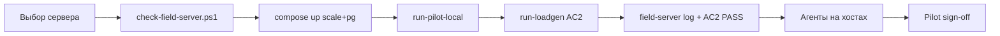

# ERA XDR — Production Readiness Assessment

**Дата оценки:** 2 июля 2026 г.  
**Версия:** Wave GA-1 (Core + AI + Response)

Оценка по слоям: **софт (код+CI)** vs **поле (железо+аудиты)** vs **прод у заказчика**.

Связано: [`Pre-Field-Code-Backlog.md`](Pre-Field-Code-Backlog.md) · [`Field-Server-Sizing.md`](Field-Server-Sizing.md) · [`Field-Server-Setup.md`](Field-Server-Setup.md) · [`ADR-0022`](adr/0022-detection-content-governance.md) · [`ADR-0023`](adr/0023-ai-investigation-explainability.md) · [`Implementation-Roadmap.md`](Implementation-Roadmap.md) §Post-GA

---

## Сводка

| Слой | % | Статус | Что это значит |
|------|---|--------|----------------|
| **Софт (код + CI + скрипты)** | **~90** | Готово к field-прогону | `ci-gates-stage10.ps1` PASS; backlog P0–P2 закрыт в коде |
| **Field-прогон (sizing-сервер)** | **~15** | Не начат | AC2 10k, pilot sign-off, soak — нужен выделенный хост |
| **Прод у заказчика (air-gap)** | **~65–70** | После пилота | + внешние аудиты, WHQL, HSM, pen-test, реальные агенты |

**Итог:** система **готова к переезду на тестовый/пилотный сервер**, но **не готова** к заявлению «production GA без оговорок» до field-доказательств.

---

## Матрица по компонентам

Легенда: **Софт** = код+тесты в репо · **Field** = прогон на sizing-сервере · **Prod** = контур заказчика

| Компонент | Софт | Field | Prod | Блокер |
|-----------|-----:|------:|-----:|--------|
| Agent capture + PII + budget | 90 | 40 | 70 | Tamper Фаза 1 only; реальные агенты на хостах — field |
| Ingest gRPC + mTLS + Kafka | 90 | 30 | 80 | Loadgen 10k на sizing-сервере |
| Event-writer → ClickHouse | 90 | 30 | 85 | CH под нагрузкой AC2 |
| Control-plane (SQLite/PG) | 90 | 40 | 75 | Postgres на field + backup restore e2e |
| License fail-closed + sealed clock | 90 | 50 | 80 | NTP/TPM на контуре заказчика |
| Detection (ITDR/NDR/exposure) | 85 | 20 | 60 | Golden = синтетика; FP suppression UI ❌ ([ADR-0022](adr/0022-detection-content-governance.md)) |
| Detection content governance | 70 | 10 | 50 | Корпус ~600 ✅; MITRE runtime map, heatmap — [ ] |
| AI-core + SOAR | 85 | 30 | 70 | Investigate MVP ✅; forensic trail — [ ] ([ADR-0023](adr/0023-ai-investigation-explainability.md)) |
| Manage (deploy/PXE/enforce) | 80 | 25 | 55 | Enforce kernel [WHQL]; PXE TFTP — field |
| PAM (vault/SSH) | 85 | 30 | 60 | RDP [security-review external] |
| Observe (SNMP/NetFlow) | 85 | 15 | 50 | Нужен сетевой lab со SNMP |
| Hybrid + OTA | 85 | 25 | 65 | Connected e2e на стенде |
| Hardening (Helm/backup/Grafana) | 85 | 20 | 70 | Soak 7×24, HA Kafka |
| Federated / P2 опции | 80 | 10 | 40 | Опциональные издания |

---

## Критерии приёмки (измеримые)

| ID | Критерий | Софт | Field | Доказательство |
|----|----------|------|-------|----------------|
| AC1 | E2E agent→CH | PASS | [ ] | `pipeline/e2e_golden_test.go`; live — field |
| AC2 | ≥10k ev/s × 5 min | smoke | **[ ]** | [`Field-Server-Sizing.md`](Field-Server-Sizing.md); `reports/loadgen-prod.log` |
| AC6 | Agent RAM < 150 MB | PASS | [ ] | CI `budget_guard` |
| Pilot | Checklist подписан | скрипты | **[ ]** | [`Pilot-Readiness-Checklist.md`](Pilot-Readiness-Checklist.md) |
| Soak | 7×24 кластер | — | **[ ]** | [gate: field] |
| Pen-test | Внешний | — | **[blocked]** | Не код |

---

## Что закрыто (доказано)

- `scripts/ci-gates-stage10.ps1` — PASS (postgres parity в docker, ADR-0006 golden, tamper, sealed clock, PII, budget)
- Prod compose: `scale` + `pg` + mTLS (`deploy/docker-compose.prod.yml`)
- Скрипты: `run-pilot-local.ps1`, `run-loadgen-prod.ps1`, `run-chaos-smoke.ps1`
- Smoke на dev: ~233 ev/s mTLS, fail=0 — [`reports/prefield-proof-2026-07-01.log`](../reports/prefield-proof-2026-07-01.log)

---

## Чего не хватает (приоритет)

### P0 — до первого осмысленного field-теста

1. **Выделить sizing-сервер** (16 vCPU / 32 GiB) — см. [`Field-Server-Setup.md`](Field-Server-Setup.md)
2. **Прогнать AC2** — `run-loadgen-prod.ps1` с `-MinEvPerSec 10000`
3. **Прогнать pilot-local** на сервере (не ноут) + зафиксировать `reports/field-server-*.log`
4. **Сменить дефолтные пароли** CH/MinIO/Postgres перед пилотом

### P1 — после первого прогона

5. Реальные агенты Win+Linux на 2–3 хостах → ingest → CH
6. SNMP/NetFlow lab для Observe
7. Backup/restore полный цикл на Postgres volume
8. Enforce path — только monitor до WHQL
9. **Post-GA (ADR-0022/0023):** MITRE runtime map, FP suppression UI, AI audit log — см. [`Implementation-Roadmap.md`](Implementation-Roadmap.md) §Post-GA

### Вне кода (не блокируют старт field)

- WHQL kernel driver · HSM crypto-audit · RDP security-review · pen-test · подпись заказчика

---

## Рекомендуемый порядок field-работ

---

## Следующий шаг

1. Прочитать [`Field-Server-Setup.md`](Field-Server-Setup.md)
2. На целевом хосте: `scripts/check-field-server.ps1`
3. Заполнить `reports/field-server-inventory.md` (шаблон в Setup)
4. Поднять стек и прогнать pilot → loadgen
