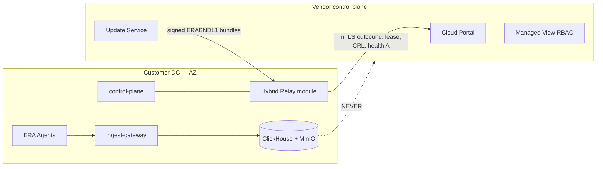

# AZ — Data Flow Diagram (Sovereign Hybrid)

Одностраничная схема потоков для пресейла/ИБ (ADR-0018 §9).  
Три языка: AZ · RU · EN.

---

## Схема (общая)

---

## AZ

| Harada qalır | Nə gedir (connected) | Protokol |
|---|---|---|
| Müştəri DC: bütün xam data, PII, case | Portal: lease, CRL, health A; Update: imzalı Sigma | mTLS, outbound-only |
| Air-gap default | Offline bundle (nosитель) | Fiziki/media |

---

## RU

| Остаётся в ЦОД AZ | Уходит наружу (connected) | Протокол |
|---|---|---|
| Все сырые данные, PII, кейсы, lake | Portal: lease, CRL, health A; Update: подписанные бандлы | mTLS, только исходящие |
| Air-gap по умолчанию | Offline-бандл на носителе | Физическая доставка |

---

## EN

| Stays in customer DC | Egress (connected) | Protocol |
|---|---|---|
| All raw data, PII, cases, lake | Portal: lease, CRL, health A; Update: signed bundles | mTLS, outbound-only |
| Air-gap default | Offline bundle on removable media | Physical delivery |

---

## Инварианты (все языки)

1. `connected` выключен по умолчанию — явное включение админом + audit.
2. Egress только через Hybrid Relay + allowlist + egress audit journal.
3. Доверяем подписи (Ed25519), не каналу — lease/CRL/bundle верифицируются до применения.
4. Ключи подписи вендора — HSM/KMS, не в репозитории.
